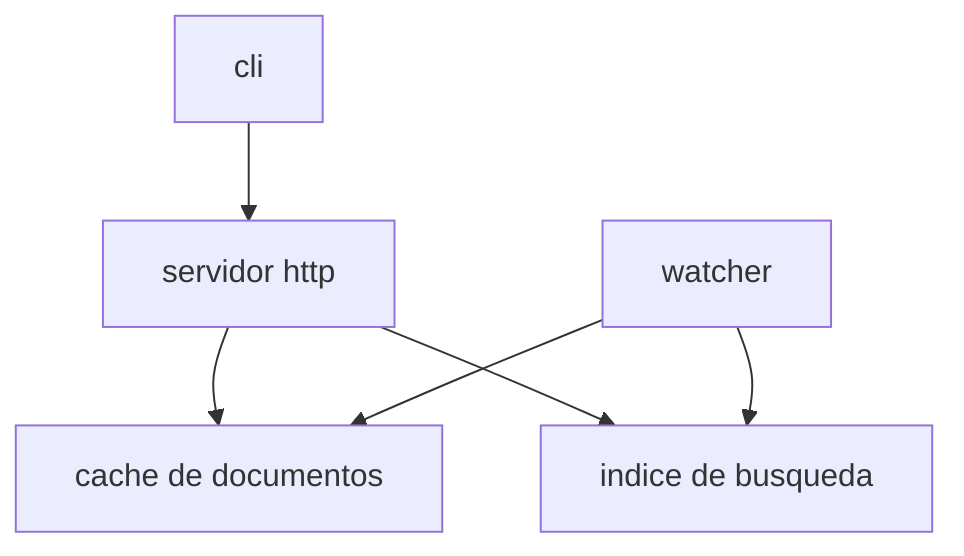

# local-docs — Plan de implementación

> **For agentic workers:** REQUIRED SUB-SKILL: Use superpowers:subagent-driven-development (recommended) or superpowers:executing-plans to implement this plan task-by-task. Steps use checkbox (`- [ ]`) syntax for tracking.

**Goal:** Construir una herramienta de línea de comandos que, ejecutada dentro de un proyecto con un directorio `docs/`, abra un visor local de su documentación markdown sin ninguna configuración previa.

**Architecture:** Un servidor Node sobre `node:http` resuelve la raíz `docs/`, construye el árbol de navegación, renderiza cada markdown a HTML bajo demanda con caché por archivo, mantiene un índice full-text en memoria y notifica los cambios del sistema de archivos por SSE. Un cliente Preact compilado con Vite consume esa API, pinta el sidebar, el documento y la tabla de contenidos, y navega sin recargar la página.

**Tech Stack:** Node.js 20+, TypeScript ESM, `node:http`, markdown-it, markdown-it-anchor, Shiki, gray-matter, chokidar, MiniSearch, Preact, Vite, Vitest, happy-dom.

**Spec:** `docs/superpowers/specs/2026-09-02-local-docs-design.md`

## Global Constraints

- Node.js 20 o superior. TypeScript con módulos ESM (`"type": "module"`, `module: NodeNext`).
- La herramienta nunca escribe dentro de la raíz de documentación. Todo el estado vive en memoria o en `localStorage` del navegador.
- El servidor escucha por omisión en `127.0.0.1`, puerto preferido `4180`.
- Ninguna ruta servida puede resolverse fuera de la raíz de documentación. Toda ruta de entrada pasa por `safeJoin` antes de tocar el sistema de archivos.
- Extensiones de documento reconocidas: `.md` y `.markdown`.
- Exclusiones del árbol: nombres que empiezan por `.` y directorios `node_modules`.
- Las rutas del árbol y de la API son relativas a la raíz y usan siempre separador `/`, en cualquier sistema operativo.
- Cada tarea termina con los tests en verde y un commit con mensaje en formato conventional commits. No se añade atribución de autoría automática.
- El paquete se publica con el cliente ya compilado: el usuario final nunca ejecuta una compilación.

---

## Estructura de archivos

| Archivo | Responsabilidad |
|---|---|
| `src/cli.ts` | Punto de entrada del binario: opciones, arranque, apertura del navegador, mensajes de error |
| `src/server/paths.ts` | Resolución segura de rutas dentro de la raíz y conversión a rutas relativas POSIX |
| `src/server/root-resolver.ts` | Localización y validación de la raíz de documentación |
| `src/server/titles.ts` | Normalización de nombres, prefijos numéricos y comparación de orden |
| `src/server/renderer.ts` | Conversión de markdown a HTML, encabezados, frontmatter y texto plano |
| `src/server/tree.ts` | Recorrido del sistema de archivos y construcción del árbol |
| `src/server/cache.ts` | Caché de documentos renderizados por ruta, con invalidación |
| `src/server/search-index.ts` | Índice full-text en memoria y generación de fragmentos |
| `src/server/events.ts` | Registro de clientes SSE y emisión de eventos |
| `src/server/watcher.ts` | Observación del sistema de archivos y propagación de cambios |
| `src/server/server.ts` | Rutas HTTP y códigos de estado |
| `src/client/main.tsx` | Montaje del cliente |
| `src/client/api.ts` | Llamadas a la API del servidor |
| `src/client/router.ts` | Sincronización entre URL y documento visible |
| `src/client/events.ts` | Cliente SSE con reconexión |
| `src/client/theme.ts` | Selección y persistencia del tema |
| `src/client/components/App.tsx` | Composición del layout y estado global |
| `src/client/components/Sidebar.tsx` | Árbol de navegación |
| `src/client/components/Viewer.tsx` | Documento renderizado y comportamiento de enlaces |
| `src/client/components/Toc.tsx` | Tabla de contenidos |
| `src/client/components/Search.tsx` | Panel de búsqueda |
| `src/client/components/States.tsx` | Estados vacíos y de error |
| `src/client/mermaid.ts` | Carga diferida y renderizado de diagramas |
| `src/client/styles/tokens.css` | Variables de color, espaciado y tipografía, tema claro y oscuro |
| `src/client/styles/app.css` | Layout y estilos de componentes |

---
### Task 1: Andamiaje del proyecto y resolución segura de rutas

**Files:**
- Create: `package.json`, `tsconfig.json`, `vitest.config.ts`, `.gitignore`
- Create: `src/server/paths.ts`
- Test: `tests/server/paths.test.ts`

**Interfaces:**
- Consumes: nada.
- Produces: `safeJoin(root: string, relative: string): string | null`, `toRelative(root: string, absolute: string): string`.

- [ ] **Step 1: Inicializar el repositorio y el paquete**

```bash
git init
npm init -y
npm pkg set name=local-docs version=0.1.0 type=module
npm pkg set bin.local-docs=./dist/cli.js
npm pkg set engines.node=">=20"
npm pkg set scripts.build="tsc -p tsconfig.json && vite build"
npm pkg set scripts.test="vitest run"
npm pkg delete main
npm install --save-dev typescript @types/node vitest
```

- [ ] **Step 2: Crear la configuración de TypeScript y de Vitest**

`tsconfig.json`:

```json
{
  "compilerOptions": {
    "target": "ES2022",
    "module": "NodeNext",
    "moduleResolution": "NodeNext",
    "lib": ["ES2022", "DOM"],
    "strict": true,
    "noUncheckedIndexedAccess": true,
    "outDir": "dist",
    "rootDir": "src",
    "sourceMap": true,
    "jsx": "react-jsx",
    "jsxImportSource": "preact",
    "skipLibCheck": true
  },
  "include": ["src/**/*"],
  "exclude": ["src/client/**/*"]
}
```

`vitest.config.ts`:

```ts
import { defineConfig } from 'vitest/config'

export default defineConfig({
  test: {
    include: ['tests/**/*.test.{ts,tsx}'],
    environment: 'node',
  },
})
```

`.gitignore`:

```
node_modules
dist
*.log
```

- [ ] **Step 3: Escribir el test que falla**

`tests/server/paths.test.ts`:

```ts
import { describe, expect, it } from 'vitest'
import path from 'node:path'
import { safeJoin, toRelative } from '../../src/server/paths.js'

const root = path.resolve('/proyecto/docs')

describe('safeJoin', () => {
  it('resuelve una ruta relativa dentro de la raiz', () => {
    expect(safeJoin(root, 'guia/inicio.md')).toBe(path.join(root, 'guia', 'inicio.md'))
  })

  it('acepta la raiz misma con cadena vacia', () => {
    expect(safeJoin(root, '')).toBe(root)
  })

  it('rechaza rutas que salen de la raiz', () => {
    expect(safeJoin(root, '../secreto.md')).toBeNull()
    expect(safeJoin(root, 'guia/../../secreto.md')).toBeNull()
  })

  it('rechaza rutas absolutas', () => {
    expect(safeJoin(root, '/etc/passwd')).toBeNull()
  })

  it('rechaza rutas con bytes nulos', () => {
    expect(safeJoin(root, 'guia\0.md')).toBeNull()
  })
})

describe('toRelative', () => {
  it('devuelve una ruta relativa con separador posix', () => {
    const absolute = path.join(root, 'guia', 'inicio.md')
    expect(toRelative(root, absolute)).toBe('guia/inicio.md')
  })
})
```

- [ ] **Step 4: Ejecutar el test y verificar que falla**

Run: `npx vitest run tests/server/paths.test.ts`
Expected: FAIL, no se encuentra el módulo `src/server/paths.js`.

- [ ] **Step 5: Escribir la implementación mínima**

`src/server/paths.ts`:

```ts
import path from 'node:path'

export function safeJoin(root: string, relative: string): string | null {
  if (relative.includes('\0')) return null
  if (path.isAbsolute(relative)) return null

  const resolvedRoot = path.resolve(root)
  const target = path.resolve(resolvedRoot, relative)

  if (target !== resolvedRoot && !target.startsWith(resolvedRoot + path.sep)) {
    return null
  }
  return target
}

export function toRelative(root: string, absolute: string): string {
  return path.relative(path.resolve(root), absolute).split(path.sep).join('/')
}
```

- [ ] **Step 6: Ejecutar el test y verificar que pasa**

Run: `npx vitest run tests/server/paths.test.ts`
Expected: PASS, 6 tests.

- [ ] **Step 7: Commit**

```bash
git add package.json package-lock.json tsconfig.json vitest.config.ts .gitignore src/server/paths.ts tests/server/paths.test.ts
git commit -m "feat: andamiaje del proyecto y resolucion segura de rutas"
```

---

### Task 2: Resolución de la raíz de documentación

**Files:**
- Create: `src/server/root-resolver.ts`
- Test: `tests/server/root-resolver.test.ts`

**Interfaces:**
- Consumes: nada.
- Produces: `resolveDocsRoot(options: { cwd: string; dir?: string }): Promise<RootResolution>` con
  `type RootResolution = { ok: true; root: string } | { ok: false; reason: 'not-found' | 'missing-dir' | 'not-a-directory' | 'unreadable'; searchedFrom: string; requested?: string }`.

- [ ] **Step 1: Escribir el test que falla**

`tests/server/root-resolver.test.ts`:

```ts
import { afterEach, describe, expect, it } from 'vitest'
import fs from 'node:fs/promises'
import os from 'node:os'
import path from 'node:path'
import { resolveDocsRoot } from '../../src/server/root-resolver.js'

const temporales: string[] = []

async function crearProyecto(): Promise<string> {
  const base = await fs.mkdtemp(path.join(os.tmpdir(), 'local-docs-'))
  const real = await fs.realpath(base)
  temporales.push(real)
  return real
}

afterEach(async () => {
  while (temporales.length > 0) {
    const dir = temporales.pop()
    if (dir) await fs.rm(dir, { recursive: true, force: true })
  }
})

describe('resolveDocsRoot', () => {
  it('encuentra docs en el directorio actual', async () => {
    const proyecto = await crearProyecto()
    await fs.mkdir(path.join(proyecto, 'docs'))

    const resultado = await resolveDocsRoot({ cwd: proyecto })

    expect(resultado).toEqual({ ok: true, root: path.join(proyecto, 'docs') })
  })

  it('sube por los directorios padre hasta encontrar docs', async () => {
    const proyecto = await crearProyecto()
    await fs.mkdir(path.join(proyecto, 'docs'))
    const anidado = path.join(proyecto, 'src', 'modulo')
    await fs.mkdir(anidado, { recursive: true })

    const resultado = await resolveDocsRoot({ cwd: anidado })

    expect(resultado).toEqual({ ok: true, root: path.join(proyecto, 'docs') })
  })

  it('informa cuando no hay ninguna raiz', async () => {
    const proyecto = await crearProyecto()

    const resultado = await resolveDocsRoot({ cwd: proyecto })

    expect(resultado).toEqual({ ok: false, reason: 'not-found', searchedFrom: proyecto })
  })

  it('usa la ruta de --dir sin buscar hacia arriba', async () => {
    const proyecto = await crearProyecto()
    await fs.mkdir(path.join(proyecto, 'docs'))
    const otro = path.join(proyecto, 'manual')
    await fs.mkdir(otro)

    const resultado = await resolveDocsRoot({ cwd: proyecto, dir: otro })

    expect(resultado).toEqual({ ok: true, root: otro })
  })

  it('informa cuando la ruta de --dir no existe', async () => {
    const proyecto = await crearProyecto()
    const inexistente = path.join(proyecto, 'no-existe')

    const resultado = await resolveDocsRoot({ cwd: proyecto, dir: inexistente })

    expect(resultado).toEqual({
      ok: false,
      reason: 'missing-dir',
      searchedFrom: proyecto,
      requested: inexistente,
    })
  })

  it('informa cuando la ruta de --dir no es un directorio', async () => {
    const proyecto = await crearProyecto()
    const archivo = path.join(proyecto, 'notas.md')
    await fs.writeFile(archivo, '# notas')

    const resultado = await resolveDocsRoot({ cwd: proyecto, dir: archivo })

    expect(resultado).toEqual({
      ok: false,
      reason: 'not-a-directory',
      searchedFrom: proyecto,
      requested: archivo,
    })
  })
})
```

- [ ] **Step 2: Ejecutar el test y verificar que falla**

Run: `npx vitest run tests/server/root-resolver.test.ts`
Expected: FAIL, no se encuentra el módulo.

- [ ] **Step 3: Escribir la implementación mínima**

`src/server/root-resolver.ts`:

```ts
import fs from 'node:fs/promises'
import path from 'node:path'
import { constants } from 'node:fs'

export type RootResolution =
  | { ok: true; root: string }
  | {
      ok: false
      reason: 'not-found' | 'missing-dir' | 'not-a-directory' | 'unreadable'
      searchedFrom: string
      requested?: string
    }

const NOMBRE_RAIZ = 'docs'

type EstadoDirectorio = 'ok' | 'missing' | 'not-a-directory' | 'unreadable'

async function comprobarDirectorio(ruta: string): Promise<EstadoDirectorio> {
  let info
  try {
    info = await fs.stat(ruta)
  } catch {
    return 'missing'
  }
  if (!info.isDirectory()) return 'not-a-directory'
  try {
    await fs.access(ruta, constants.R_OK | constants.X_OK)
  } catch {
    return 'unreadable'
  }
  return 'ok'
}

export async function resolveDocsRoot(options: { cwd: string; dir?: string }): Promise<RootResolution> {
  const cwd = path.resolve(options.cwd)

  if (options.dir !== undefined) {
    const requested = path.resolve(cwd, options.dir)
    const estado = await comprobarDirectorio(requested)
    if (estado === 'ok') return { ok: true, root: requested }
    const reason = estado === 'missing' ? 'missing-dir' : estado
    return { ok: false, reason, searchedFrom: cwd, requested }
  }

  let actual = cwd
  for (;;) {
    const candidato = path.join(actual, NOMBRE_RAIZ)
    const estado = await comprobarDirectorio(candidato)
    if (estado === 'ok') return { ok: true, root: candidato }
    if (estado === 'unreadable') {
      return { ok: false, reason: 'unreadable', searchedFrom: cwd, requested: candidato }
    }
    const padre = path.dirname(actual)
    if (padre === actual) return { ok: false, reason: 'not-found', searchedFrom: cwd }
    actual = padre
  }
}
```

- [ ] **Step 4: Ejecutar el test y verificar que pasa**

Run: `npx vitest run tests/server/root-resolver.test.ts`
Expected: PASS, 6 tests.

- [ ] **Step 5: Commit**

```bash
git add src/server/root-resolver.ts tests/server/root-resolver.test.ts
git commit -m "feat: resolucion de la raiz de documentacion"
```

---

### Task 3: Títulos, prefijos numéricos y orden

**Files:**
- Create: `src/server/titles.ts`
- Test: `tests/server/titles.test.ts`

**Interfaces:**
- Consumes: nada.
- Produces: `stripOrderPrefix(name: string): { prefixOrder: number | null; rest: string }`, `humanizeName(name: string): string`, `compareEntries(a: SortableEntry, b: SortableEntry): number`, `interface SortableEntry { type: 'directory' | 'document'; order: number | null; prefixOrder: number | null; name: string }`.

- [ ] **Step 1: Escribir el test que falla**

`tests/server/titles.test.ts`:

```ts
import { describe, expect, it } from 'vitest'
import { compareEntries, humanizeName, stripOrderPrefix, type SortableEntry } from '../../src/server/titles.js'

describe('stripOrderPrefix', () => {
  it('extrae el prefijo numerico', () => {
    expect(stripOrderPrefix('01-guia-de-inicio.md')).toEqual({ prefixOrder: 1, rest: 'guia-de-inicio.md' })
  })

  it('acepta guion bajo y punto como separador', () => {
    expect(stripOrderPrefix('02_avanzado')).toEqual({ prefixOrder: 2, rest: 'avanzado' })
    expect(stripOrderPrefix('3.notas.md')).toEqual({ prefixOrder: 3, rest: 'notas.md' })
  })

  it('devuelve el nombre intacto cuando no hay prefijo', () => {
    expect(stripOrderPrefix('inicio.md')).toEqual({ prefixOrder: null, rest: 'inicio.md' })
  })

  it('no confunde un nombre que empieza por numero sin separador', () => {
    expect(stripOrderPrefix('2024informe.md')).toEqual({ prefixOrder: null, rest: '2024informe.md' })
  })
})

describe('humanizeName', () => {
  it('quita extension, prefijo y separadores', () => {
    expect(humanizeName('01-guia-de-inicio.md')).toBe('Guia de inicio')
  })

  it('acepta guiones bajos', () => {
    expect(humanizeName('mi_documento.markdown')).toBe('Mi documento')
  })

  it('acepta nombres de directorio', () => {
    expect(humanizeName('referencia-api')).toBe('Referencia api')
  })
})

describe('compareEntries', () => {
  const entrada = (parcial: Partial<SortableEntry>): SortableEntry => ({
    type: 'document',
    order: null,
    prefixOrder: null,
    name: 'x',
    ...parcial,
  })

  it('coloca los directorios antes que los documentos', () => {
    expect(compareEntries(entrada({ type: 'directory', name: 'z' }), entrada({ name: 'a' }))).toBeLessThan(0)
  })

  it('ordena por el campo order del frontmatter', () => {
    expect(compareEntries(entrada({ order: 1 }), entrada({ order: 2 }))).toBeLessThan(0)
  })

  it('coloca los elementos con order antes que los que no lo tienen', () => {
    expect(compareEntries(entrada({ order: 5 }), entrada({ order: null }))).toBeLessThan(0)
  })

  it('usa el prefijo numerico cuando no hay order', () => {
    expect(compareEntries(entrada({ prefixOrder: 1 }), entrada({ prefixOrder: 10 }))).toBeLessThan(0)
  })

  it('ordena alfabeticamente de forma natural e insensible a mayusculas', () => {
    expect(compareEntries(entrada({ name: 'archivo2' }), entrada({ name: 'archivo10' }))).toBeLessThan(0)
    expect(compareEntries(entrada({ name: 'Beta' }), entrada({ name: 'alfa' }))).toBeGreaterThan(0)
  })
})
```

- [ ] **Step 2: Ejecutar el test y verificar que falla**

Run: `npx vitest run tests/server/titles.test.ts`
Expected: FAIL, no se encuentra el módulo.

- [ ] **Step 3: Escribir la implementación mínima**

`src/server/titles.ts`:

```ts
const PREFIJO = /^(\d{1,4})[-_.](.+)$/
const EXTENSIONES = /\.(md|markdown)$/i

export interface SortableEntry {
  type: 'directory' | 'document'
  order: number | null
  prefixOrder: number | null
  name: string
}

export function stripOrderPrefix(name: string): { prefixOrder: number | null; rest: string } {
  const coincidencia = PREFIJO.exec(name)
  if (!coincidencia) return { prefixOrder: null, rest: name }
  return { prefixOrder: Number(coincidencia[1]), rest: coincidencia[2] as string }
}

export function humanizeName(name: string): string {
  const sinExtension = name.replace(EXTENSIONES, '')
  const { rest } = stripOrderPrefix(sinExtension)
  const palabras = rest.replace(/[-_]+/g, ' ').trim()
  if (palabras.length === 0) return sinExtension
  return palabras.charAt(0).toUpperCase() + palabras.slice(1)
}

const colador = new Intl.Collator('es', { numeric: true, sensitivity: 'base' })

function pesoDeTipo(entry: SortableEntry): number {
  return entry.type === 'directory' ? 0 : 1
}

export function compareEntries(a: SortableEntry, b: SortableEntry): number {
  const tipo = pesoDeTipo(a) - pesoDeTipo(b)
  if (tipo !== 0) return tipo

  const ordenA = a.order ?? a.prefixOrder
  const ordenB = b.order ?? b.prefixOrder
  if (ordenA !== null && ordenB !== null && ordenA !== ordenB) return ordenA - ordenB
  if (ordenA !== null && ordenB === null) return -1
  if (ordenA === null && ordenB !== null) return 1

  return colador.compare(a.name, b.name)
}
```

- [ ] **Step 4: Ejecutar el test y verificar que pasa**

Run: `npx vitest run tests/server/titles.test.ts`
Expected: PASS, 12 tests.

- [ ] **Step 5: Commit**

```bash
git add src/server/titles.ts tests/server/titles.test.ts
git commit -m "feat: normalizacion de titulos y reglas de orden"
```

---

### Task 4: Renderizado de markdown

**Files:**
- Create: `src/server/renderer.ts`
- Test: `tests/server/renderer.test.ts`

**Interfaces:**
- Consumes: nada.
- Produces:
  - `interface Heading { level: number; id: string; text: string }`
  - `interface RenderedDocument { html: string; headings: Heading[]; frontmatter: Record<string, unknown>; plainText: string; firstH1: string | null; warnings: string[] }`
  - `interface Renderer { render(source: string): RenderedDocument }`
  - `createRenderer(): Promise<Renderer>`
  - `readHeadMetadata(filePath: string): Promise<{ frontmatter: Record<string, unknown>; firstH1: string | null }>`
  - `slugify(text: string): string`

`readHeadMetadata` lee solo los primeros 4096 bytes del archivo. Lo usa el árbol para calcular títulos sin renderizar el documento completo.

- [ ] **Step 1: Instalar las dependencias de renderizado**

```bash
npm install markdown-it markdown-it-anchor gray-matter shiki
npm install --save-dev @types/markdown-it
```

- [ ] **Step 2: Escribir el test que falla**

`tests/server/renderer.test.ts`:

```ts
import { afterEach, beforeAll, describe, expect, it } from 'vitest'
import fs from 'node:fs/promises'
import os from 'node:os'
import path from 'node:path'
import { createRenderer, readHeadMetadata, type Renderer } from '../../src/server/renderer.js'

let renderer: Renderer

beforeAll(async () => {
  renderer = await createRenderer()
})

describe('render', () => {
  it('convierte encabezados y parrafos en html', () => {
    const resultado = renderer.render('# Titulo\n\nUn parrafo.')
    expect(resultado.html).toContain('<h1')
    expect(resultado.html).toContain('Titulo')
    expect(resultado.html).toContain('<p>Un parrafo.</p>')
  })

  it('asigna identificadores a los encabezados y los devuelve en headings', () => {
    const resultado = renderer.render('# Titulo\n\n## Primera seccion\n\n### Detalle')
    expect(resultado.headings).toEqual([
      { level: 1, id: 'titulo', text: 'Titulo' },
      { level: 2, id: 'primera-seccion', text: 'Primera seccion' },
      { level: 3, id: 'detalle', text: 'Detalle' },
    ])
    expect(resultado.html).toContain('id="primera-seccion"')
  })

  it('separa el frontmatter del contenido', () => {
    const resultado = renderer.render('---\ntitle: Instalacion\norder: 2\n---\n\n# Otro titulo')
    expect(resultado.frontmatter).toEqual({ title: 'Instalacion', order: 2 })
    expect(resultado.html).not.toContain('order')
    expect(resultado.firstH1).toBe('Otro titulo')
  })

  it('avisa cuando el frontmatter es invalido sin dejar de renderizar', () => {
    const resultado = renderer.render('---\ntitle: [sin cerrar\n---\n\n# Contenido')
    expect(resultado.warnings).toContain('frontmatter-invalido')
    expect(resultado.frontmatter).toEqual({})
    expect(resultado.html).toContain('Contenido')
  })

  it('resalta los bloques de codigo con lenguaje conocido', () => {
    const resultado = renderer.render('```js\nconst a = 1\n```')
    expect(resultado.html).toContain('<pre')
    expect(resultado.html).toContain('style=')
  })

  it('marca los bloques mermaid para el cliente sin resaltarlos', () => {
    const resultado = renderer.render('```mermaid\ngraph TD;\nA-->B;\n```')
    expect(resultado.html).toContain('class="mermaid"')
    expect(resultado.html).toContain('graph TD;')
  })

  it('extrae texto plano sin marcado para el indice de busqueda', () => {
    const resultado = renderer.render('# Titulo\n\nRequiere **Node** 20.')
    expect(resultado.plainText).toContain('Requiere')
    expect(resultado.plainText).not.toContain('<p>')
  })

  it('anade target y rel a los enlaces externos', () => {
    const resultado = renderer.render('[externo](https://ejemplo.com)')
    expect(resultado.html).toContain('target="_blank"')
    expect(resultado.html).toContain('rel="noopener noreferrer"')
  })
})

describe('readHeadMetadata', () => {
  const temporales: string[] = []

  afterEach(async () => {
    while (temporales.length > 0) {
      const dir = temporales.pop()
      if (dir) await fs.rm(dir, { recursive: true, force: true })
    }
  })

  it('lee el frontmatter y el primer h1 sin cargar todo el archivo', async () => {
    const base = await fs.mkdtemp(path.join(os.tmpdir(), 'local-docs-head-'))
    temporales.push(base)
    const archivo = path.join(base, 'doc.md')
    const relleno = 'x'.repeat(20000)
    await fs.writeFile(archivo, `---\ntitle: Desde frontmatter\n---\n\n# Desde h1\n\n${relleno}`)

    const resultado = await readHeadMetadata(archivo)

    expect(resultado.frontmatter).toEqual({ title: 'Desde frontmatter' })
    expect(resultado.firstH1).toBe('Desde h1')
  })
})
```

- [ ] **Step 3: Ejecutar el test y verificar que falla**

Run: `npx vitest run tests/server/renderer.test.ts`
Expected: FAIL, no se encuentra el módulo.

- [ ] **Step 4: Escribir la implementación mínima**

`src/server/renderer.ts`:

```ts
import fs from 'node:fs/promises'
import matter from 'gray-matter'
import MarkdownIt from 'markdown-it'
import anchor from 'markdown-it-anchor'
import { createHighlighter, type Highlighter } from 'shiki'

const TAMANO_CABECERA = 4096
const LENGUAJES = [
  'js', 'ts', 'tsx', 'jsx', 'json', 'bash', 'shell', 'python', 'go', 'rust',
  'java', 'sql', 'yaml', 'html', 'css', 'markdown', 'diff',
]

export interface Heading {
  level: number
  id: string
  text: string
}

export interface RenderedDocument {
  html: string
  headings: Heading[]
  frontmatter: Record<string, unknown>
  plainText: string
  firstH1: string | null
  warnings: string[]
}

export interface Renderer {
  render(source: string): RenderedDocument
}

export function slugify(text: string): string {
  return text
    .toLowerCase()
    .normalize('NFD')
    .replace(/[\u0300-\u036f]/g, '')
    .replace(/[^a-z0-9\s-]/g, '')
    .trim()
    .replace(/\s+/g, '-')
}

function escapar(texto: string): string {
  return texto
    .replace(/&/g, '&amp;')
    .replace(/</g, '&lt;')
    .replace(/>/g, '&gt;')
    .replace(/"/g, '&quot;')
}

function separarFrontmatter(source: string): {
  content: string
  frontmatter: Record<string, unknown>
  warnings: string[]
} {
  try {
    const resultado = matter(source)
    return {
      content: resultado.content,
      frontmatter: (resultado.data ?? {}) as Record<string, unknown>,
      warnings: [],
    }
  } catch {
    const sinBloque = source.replace(/^---\r?\n[\s\S]*?\r?\n---\r?\n?/, '')
    return { content: sinBloque, frontmatter: {}, warnings: ['frontmatter-invalido'] }
  }
}

function extraerEncabezados(md: MarkdownIt, content: string): Heading[] {
  const tokens = md.parse(content, {})
  const headings: Heading[] = []
  const usados = new Map<string, number>()

  for (let i = 0; i < tokens.length; i += 1) {
    const token = tokens[i]
    if (!token || token.type !== 'heading_open') continue
    const texto = tokens[i + 1]?.content ?? ''
    const base = slugify(texto)
    const repeticiones = usados.get(base) ?? 0
    usados.set(base, repeticiones + 1)
    headings.push({
      level: Number(token.tag.slice(1)),
      id: repeticiones === 0 ? base : `${base}-${repeticiones}`,
      text: texto,
    })
  }
  return headings
}

function extraerTextoPlano(md: MarkdownIt, content: string): string {
  const tokens = md.parse(content, {})
  const partes: string[] = []
  for (const token of tokens) {
    if (token.type === 'inline') partes.push(token.content)
    else if (token.type === 'fence' || token.type === 'code_block') partes.push(token.content)
  }
  return partes.join('\n').trim()
}

export async function createRenderer(): Promise<Renderer> {
  const highlighter: Highlighter = await createHighlighter({
    themes: ['github-light'],
    langs: LENGUAJES,
  })

  const md = new MarkdownIt({
    html: false,
    linkify: true,
    highlight(code, lang) {
      if (lang === 'mermaid') {
        return `<pre class="mermaid">${escapar(code)}</pre>`
      }
      if (lang && highlighter.getLoadedLanguages().includes(lang)) {
        return highlighter.codeToHtml(code, { lang, theme: 'github-light' })
      }
      return `<pre class="code"><code>${escapar(code)}</code></pre>`
    },
  })

  md.use(anchor, { slugify, tabIndex: false })

  const enlacePorDefecto = md.renderer.rules.link_open
  md.renderer.rules.link_open = (tokens, idx, options, env, self) => {
    const token = tokens[idx]
    const href = token?.attrGet('href') ?? ''
    if (/^https?:\/\//i.test(href)) {
      token?.attrSet('target', '_blank')
      token?.attrSet('rel', 'noopener noreferrer')
    }
    return enlacePorDefecto
      ? enlacePorDefecto(tokens, idx, options, env, self)
      : self.renderToken(tokens, idx, options)
  }

  return {
    render(source: string): RenderedDocument {
      const { content, frontmatter, warnings } = separarFrontmatter(source)
      const headings = extraerEncabezados(md, content)
      const primero = headings.find((h) => h.level === 1)
      return {
        html: md.render(content),
        headings,
        frontmatter,
        plainText: extraerTextoPlano(md, content),
        firstH1: primero ? primero.text : null,
        warnings,
      }
    },
  }
}

export async function readHeadMetadata(filePath: string): Promise<{
  frontmatter: Record<string, unknown>
  firstH1: string | null
}> {
  const manejador = await fs.open(filePath, 'r')
  try {
    const buffer = Buffer.alloc(TAMANO_CABECERA)
    const { bytesRead } = await manejador.read(buffer, 0, TAMANO_CABECERA, 0)
    const cabecera = buffer.subarray(0, bytesRead).toString('utf8')
    const { content, frontmatter } = separarFrontmatter(cabecera)
    const coincidencia = /^#\s+(.+)$/m.exec(content)
    return { frontmatter, firstH1: coincidencia ? coincidencia[1]!.trim() : null }
  } finally {
    await manejador.close()
  }
}
```

El identificador de cada encabezado se calcula con la misma función `slugify` que se pasa a `markdown-it-anchor`, de modo que los anclas del HTML y los de `headings` siempre coinciden.

- [ ] **Step 5: Ejecutar el test y verificar que pasa**

Run: `npx vitest run tests/server/renderer.test.ts`
Expected: PASS, 9 tests.

- [ ] **Step 6: Commit**

```bash
git add package.json package-lock.json src/server/renderer.ts tests/server/renderer.test.ts
git commit -m "feat: renderizado de markdown con encabezados, frontmatter y texto plano"
```

---
### Task 5: Construcción del árbol de navegación

**Files:**
- Create: `src/server/tree.ts`
- Test: `tests/server/tree.test.ts`

**Interfaces:**
- Consumes: `safeJoin`, `toRelative` (Task 1), `humanizeName`, `stripOrderPrefix`, `compareEntries` (Task 3), `readHeadMetadata` (Task 4).
- Produces:
  - `interface DocumentNode { type: 'document'; path: string; title: string; readable: boolean }`
  - `interface DirectoryNode { type: 'directory'; path: string; title: string; hasIndex: boolean; indexPath: string | null; children: TreeNode[] }`
  - `type TreeNode = DocumentNode | DirectoryNode`
  - `interface TreeResult { nodes: TreeNode[]; rootIndex: string | null; rootTitle: string | null }`
  - `buildTree(root: string): Promise<TreeResult>`
  - `findFirstDocument(nodes: TreeNode[]): string | null`
  - `findDocument(nodes: TreeNode[], path: string): DocumentNode | null`

Regla uniforme: el documento índice (`index.md` o `README.md`) de un directorio no aparece como hijo de ese directorio. En la raíz, el índice se devuelve en `rootIndex` y tampoco aparece en `nodes`.

- [ ] **Step 1: Escribir el test que falla**

`tests/server/tree.test.ts`:

```ts
import { afterEach, describe, expect, it } from 'vitest'
import fs from 'node:fs/promises'
import os from 'node:os'
import path from 'node:path'
import { buildTree, findDocument, findFirstDocument, type DirectoryNode } from '../../src/server/tree.js'

const temporales: string[] = []

async function crearRaiz(archivos: Record<string, string>): Promise<string> {
  const base = await fs.realpath(await fs.mkdtemp(path.join(os.tmpdir(), 'local-docs-tree-')))
  temporales.push(base)
  for (const [relativo, contenido] of Object.entries(archivos)) {
    const destino = path.join(base, relativo)
    await fs.mkdir(path.dirname(destino), { recursive: true })
    await fs.writeFile(destino, contenido)
  }
  return base
}

afterEach(async () => {
  while (temporales.length > 0) {
    const dir = temporales.pop()
    if (dir) await fs.rm(dir, { recursive: true, force: true })
  }
})

describe('buildTree', () => {
  it('lista documentos markdown con rutas relativas posix', async () => {
    const raiz = await crearRaiz({ 'inicio.md': '# Inicio', 'guia/uso.md': '# Uso' })

    const { nodes } = await buildTree(raiz)

    expect(nodes).toEqual([
      {
        type: 'directory',
        path: 'guia',
        title: 'Guia',
        hasIndex: false,
        indexPath: null,
        children: [{ type: 'document', path: 'guia/uso.md', title: 'Uso', readable: true }],
      },
      { type: 'document', path: 'inicio.md', title: 'Inicio', readable: true },
    ])
  })

  it('ignora archivos ocultos, node_modules y extensiones no markdown', async () => {
    const raiz = await crearRaiz({
      'visible.md': '# Visible',
      '.oculto.md': '# Oculto',
      '.git/config.md': 'x',
      'node_modules/paquete/readme.md': 'x',
      'imagen.png': 'x',
    })

    const { nodes } = await buildTree(raiz)

    expect(nodes.map((n) => n.path)).toEqual(['visible.md'])
  })

  it('toma el titulo del frontmatter antes que del primer h1', async () => {
    const raiz = await crearRaiz({ 'doc.md': '---\ntitle: Desde frontmatter\n---\n\n# Desde h1' })

    const { nodes } = await buildTree(raiz)

    expect(nodes[0]?.title).toBe('Desde frontmatter')
  })

  it('toma el titulo del primer h1 antes que del nombre de archivo', async () => {
    const raiz = await crearRaiz({ 'mi-doc.md': '# Titulo real' })

    const { nodes } = await buildTree(raiz)

    expect(nodes[0]?.title).toBe('Titulo real')
  })

  it('usa el nombre normalizado cuando no hay frontmatter ni h1', async () => {
    const raiz = await crearRaiz({ '01-guia-de-inicio.md': 'Solo texto.' })

    const { nodes } = await buildTree(raiz)

    expect(nodes[0]?.title).toBe('Guia de inicio')
  })

  it('ordena por order del frontmatter, luego por prefijo y luego alfabeticamente', async () => {
    const raiz = await crearRaiz({
      'zeta.md': '---\norder: 1\n---\n',
      '02-medio.md': 'x',
      'alfa.md': 'x',
      '01-primero.md': 'x',
    })

    const { nodes } = await buildTree(raiz)

    expect(nodes.map((n) => n.path)).toEqual(['zeta.md', '01-primero.md', '02-medio.md', 'alfa.md'])
  })

  it('convierte index.md en el documento del directorio y lo excluye de los hijos', async () => {
    const raiz = await crearRaiz({
      'guia/index.md': '# Guia completa',
      'guia/uso.md': '# Uso',
    })

    const { nodes } = await buildTree(raiz)
    const directorio = nodes[0] as DirectoryNode

    expect(directorio.hasIndex).toBe(true)
    expect(directorio.indexPath).toBe('guia/index.md')
    expect(directorio.title).toBe('Guia completa')
    expect(directorio.children.map((n) => n.path)).toEqual(['guia/uso.md'])
  })

  it('prefiere index.md sobre README.md', async () => {
    const raiz = await crearRaiz({
      'guia/index.md': '# Desde index',
      'guia/README.md': '# Desde readme',
      'guia/uso.md': '# Uso',
    })

    const { nodes } = await buildTree(raiz)
    const directorio = nodes[0] as DirectoryNode

    expect(directorio.indexPath).toBe('guia/index.md')
    expect(directorio.children.map((n) => n.path)).toEqual(['guia/README.md', 'guia/uso.md'])
  })

  it('devuelve el indice de la raiz por separado y no lo incluye en los nodos', async () => {
    const raiz = await crearRaiz({ 'README.md': '# Portada', 'otro.md': '# Otro' })

    const { nodes, rootIndex, rootTitle } = await buildTree(raiz)

    expect(rootIndex).toBe('README.md')
    expect(rootTitle).toBe('Portada')
    expect(nodes.map((n) => n.path)).toEqual(['otro.md'])
  })

  it('devuelve un arbol vacio cuando la raiz no tiene documentos', async () => {
    const raiz = await crearRaiz({ 'imagen.png': 'x' })

    const resultado = await buildTree(raiz)

    expect(resultado).toEqual({ nodes: [], rootIndex: null, rootTitle: null })
  })
})

describe('findFirstDocument', () => {
  it('devuelve el primer documento en el orden del arbol', async () => {
    const raiz = await crearRaiz({ 'guia/uso.md': '# Uso', 'zeta.md': '# Zeta' })

    const { nodes } = await buildTree(raiz)

    expect(findFirstDocument(nodes)).toBe('guia/uso.md')
  })

  it('devuelve el indice de un directorio si no tiene hijos documentales', async () => {
    const raiz = await crearRaiz({ 'guia/index.md': '# Guia' })

    const { nodes } = await buildTree(raiz)

    expect(findFirstDocument(nodes)).toBe('guia/index.md')
  })
})

describe('findDocument', () => {
  it('localiza un documento anidado por su ruta', async () => {
    const raiz = await crearRaiz({ 'guia/uso.md': '# Uso' })

    const { nodes } = await buildTree(raiz)

    expect(findDocument(nodes, 'guia/uso.md')?.title).toBe('Uso')
    expect(findDocument(nodes, 'guia/inexistente.md')).toBeNull()
  })
})
```

- [ ] **Step 2: Ejecutar el test y verificar que falla**

Run: `npx vitest run tests/server/tree.test.ts`
Expected: FAIL, no se encuentra el módulo.

- [ ] **Step 3: Escribir la implementación mínima**

`src/server/tree.ts`:

```ts
import fs from 'node:fs/promises'
import path from 'node:path'
import { constants } from 'node:fs'
import { readHeadMetadata } from './renderer.js'
import { compareEntries, humanizeName, stripOrderPrefix, type SortableEntry } from './titles.js'

const EXTENSIONES = new Set(['.md', '.markdown'])
const NOMBRES_INDICE = ['index.md', 'index.markdown', 'README.md', 'readme.md']
const EXCLUIDOS = new Set(['node_modules'])

export interface DocumentNode {
  type: 'document'
  path: string
  title: string
  readable: boolean
}

export interface DirectoryNode {
  type: 'directory'
  path: string
  title: string
  hasIndex: boolean
  indexPath: string | null
  children: TreeNode[]
}

export type TreeNode = DocumentNode | DirectoryNode

export interface TreeResult {
  nodes: TreeNode[]
  rootIndex: string | null
  rootTitle: string | null
}

interface NodoConOrden {
  node: TreeNode
  sortable: SortableEntry
}

function esDocumento(nombre: string): boolean {
  return EXTENSIONES.has(path.extname(nombre).toLowerCase())
}

function esExcluido(nombre: string): boolean {
  return nombre.startsWith('.') || EXCLUIDOS.has(nombre)
}

async function esLegible(rutaAbsoluta: string): Promise<boolean> {
  try {
    await fs.access(rutaAbsoluta, constants.R_OK)
    return true
  } catch {
    return false
  }
}

function ordenDeFrontmatter(frontmatter: Record<string, unknown>): number | null {
  const valor = frontmatter.order
  return typeof valor === 'number' && Number.isFinite(valor) ? valor : null
}

function tituloDeFrontmatter(frontmatter: Record<string, unknown>): string | null {
  const valor = frontmatter.title
  return typeof valor === 'string' && valor.trim().length > 0 ? valor.trim() : null
}

async function metadatosDeDocumento(rutaAbsoluta: string, nombre: string): Promise<{
  title: string
  order: number | null
  readable: boolean
}> {
  const readable = await esLegible(rutaAbsoluta)
  if (!readable) {
    return { title: humanizeName(nombre), order: null, readable: false }
  }
  try {
    const { frontmatter, firstH1 } = await readHeadMetadata(rutaAbsoluta)
    const title = tituloDeFrontmatter(frontmatter) ?? firstH1 ?? humanizeName(nombre)
    return { title, order: ordenDeFrontmatter(frontmatter), readable: true }
  } catch {
    return { title: humanizeName(nombre), order: null, readable: false }
  }
}

function elegirIndice(nombres: string[]): string | null {
  for (const candidato of NOMBRES_INDICE) {
    const encontrado = nombres.find((nombre) => nombre === candidato)
    if (encontrado) return encontrado
  }
  return null
}

async function construirNivel(root: string, relativo: string): Promise<{
  nodos: TreeNode[]
  indice: string | null
  tituloIndice: string | null
}> {
  const absoluto = path.join(root, relativo)
  const entradas = await fs.readdir(absoluto, { withFileTypes: true })

  const nombresDeArchivo = entradas.filter((e) => e.isFile() && !esExcluido(e.name)).map((e) => e.name)
  const indice = elegirIndice(nombresDeArchivo)
  let tituloIndice: string | null = null

  const pendientes: NodoConOrden[] = []

  for (const entrada of entradas) {
    if (esExcluido(entrada.name)) continue
    const rutaRelativa = relativo === '' ? entrada.name : `${relativo}/${entrada.name}`
    const rutaAbsoluta = path.join(root, rutaRelativa)
    const { prefixOrder } = stripOrderPrefix(entrada.name)

    if (entrada.isDirectory()) {
      const hijo = await construirNivel(root, rutaRelativa)
      if (hijo.nodos.length === 0 && hijo.indice === null) continue
      const indicePath = hijo.indice === null ? null : `${rutaRelativa}/${hijo.indice}`
      pendientes.push({
        node: {
          type: 'directory',
          path: rutaRelativa,
          title: hijo.tituloIndice ?? humanizeName(entrada.name),
          hasIndex: indicePath !== null,
          indexPath: indicePath,
          children: hijo.nodos,
        },
        sortable: { type: 'directory', order: null, prefixOrder, name: entrada.name },
      })
      continue
    }

    if (!entrada.isFile() || !esDocumento(entrada.name)) continue

    const metadatos = await metadatosDeDocumento(rutaAbsoluta, entrada.name)

    if (entrada.name === indice) {
      tituloIndice = metadatos.title
      continue
    }

    pendientes.push({
      node: {
        type: 'document',
        path: rutaRelativa,
        title: metadatos.title,
        readable: metadatos.readable,
      },
      sortable: { type: 'document', order: metadatos.order, prefixOrder, name: entrada.name },
    })
  }

  pendientes.sort((a, b) => compareEntries(a.sortable, b.sortable))
  return { nodos: pendientes.map((p) => p.node), indice, tituloIndice }
}

export async function buildTree(root: string): Promise<TreeResult> {
  const nivel = await construirNivel(root, '')
  return { nodes: nivel.nodos, rootIndex: nivel.indice, rootTitle: nivel.tituloIndice }
}

export function findFirstDocument(nodes: TreeNode[]): string | null {
  for (const node of nodes) {
    if (node.type === 'document') return node.path
    if (node.indexPath !== null) return node.indexPath
    const anidado = findFirstDocument(node.children)
    if (anidado !== null) return anidado
  }
  return null
}

export function findDocument(nodes: TreeNode[], target: string): DocumentNode | null {
  for (const node of nodes) {
    if (node.type === 'document') {
      if (node.path === target) return node
      continue
    }
    const encontrado = findDocument(node.children, target)
    if (encontrado !== null) return encontrado
  }
  return null
}
```

Nota sobre el orden de un directorio: un directorio no tiene frontmatter propio, por lo que su `order` es siempre `null` y solo puede ordenarse por prefijo numérico o por nombre.

- [ ] **Step 4: Ejecutar el test y verificar que pasa**

Run: `npx vitest run tests/server/tree.test.ts`
Expected: PASS, 13 tests.

- [ ] **Step 5: Commit**

```bash
git add src/server/tree.ts tests/server/tree.test.ts
git commit -m "feat: construccion del arbol de navegacion"
```

---

### Task 6: Caché de documentos renderizados

**Files:**
- Create: `src/server/cache.ts`
- Test: `tests/server/cache.test.ts`

**Interfaces:**
- Consumes: `safeJoin` (Task 1), `Renderer`, `RenderedDocument` (Task 4).
- Produces:
  - `class DocumentError extends Error` con `code: 'not-found' | 'forbidden' | 'unreadable'`
  - `interface CachedDocument extends RenderedDocument { mtimeMs: number }`
  - `class DocumentCache` con `get(relPath: string): Promise<CachedDocument>`, `invalidate(relPath: string): void`, `clear(): void`, `has(relPath: string): boolean`

- [ ] **Step 1: Escribir el test que falla**

`tests/server/cache.test.ts`:

```ts
import { afterEach, beforeAll, describe, expect, it } from 'vitest'
import fs from 'node:fs/promises'
import os from 'node:os'
import path from 'node:path'
import { DocumentCache, DocumentError } from '../../src/server/cache.js'
import { createRenderer, type Renderer } from '../../src/server/renderer.js'

let renderer: Renderer
const temporales: string[] = []

beforeAll(async () => {
  renderer = await createRenderer()
})

async function crearRaiz(): Promise<string> {
  const base = await fs.realpath(await fs.mkdtemp(path.join(os.tmpdir(), 'local-docs-cache-')))
  temporales.push(base)
  return base
}

afterEach(async () => {
  while (temporales.length > 0) {
    const dir = temporales.pop()
    if (dir) await fs.rm(dir, { recursive: true, force: true })
  }
})

describe('DocumentCache', () => {
  it('renderiza el documento en la primera peticion', async () => {
    const raiz = await crearRaiz()
    await fs.writeFile(path.join(raiz, 'doc.md'), '# Titulo')
    const cache = new DocumentCache(raiz, renderer)

    const documento = await cache.get('doc.md')

    expect(documento.html).toContain('<h1')
    expect(cache.has('doc.md')).toBe(true)
  })

  it('reutiliza el resultado mientras el archivo no cambia', async () => {
    const raiz = await crearRaiz()
    const archivo = path.join(raiz, 'doc.md')
    await fs.writeFile(archivo, '# Original')
    const cache = new DocumentCache(raiz, renderer)

    const primero = await cache.get('doc.md')
    const segundo = await cache.get('doc.md')

    expect(segundo).toBe(primero)
  })

  it('vuelve a renderizar despues de invalidar', async () => {
    const raiz = await crearRaiz()
    const archivo = path.join(raiz, 'doc.md')
    await fs.writeFile(archivo, '# Original')
    const cache = new DocumentCache(raiz, renderer)
    await cache.get('doc.md')

    await fs.writeFile(archivo, '# Modificado')
    cache.invalidate('doc.md')
    const actualizado = await cache.get('doc.md')

    expect(actualizado.html).toContain('Modificado')
  })

  it('detecta un cambio de fecha de modificacion aunque no se invalide', async () => {
    const raiz = await crearRaiz()
    const archivo = path.join(raiz, 'doc.md')
    await fs.writeFile(archivo, '# Original')
    const cache = new DocumentCache(raiz, renderer)
    await cache.get('doc.md')

    await fs.writeFile(archivo, '# Modificado')
    const futuro = new Date(Date.now() + 2000)
    await fs.utimes(archivo, futuro, futuro)

    const actualizado = await cache.get('doc.md')
    expect(actualizado.html).toContain('Modificado')
  })

  it('lanza not-found cuando el documento no existe', async () => {
    const raiz = await crearRaiz()
    const cache = new DocumentCache(raiz, renderer)

    await expect(cache.get('inexistente.md')).rejects.toMatchObject({ code: 'not-found' })
  })

  it('lanza forbidden cuando la ruta sale de la raiz', async () => {
    const raiz = await crearRaiz()
    const cache = new DocumentCache(raiz, renderer)

    await expect(cache.get('../fuera.md')).rejects.toMatchObject({ code: 'forbidden' })
  })

  it('lanza not-found cuando la ruta no es un documento markdown', async () => {
    const raiz = await crearRaiz()
    await fs.writeFile(path.join(raiz, 'imagen.png'), 'x')
    const cache = new DocumentCache(raiz, renderer)

    await expect(cache.get('imagen.png')).rejects.toBeInstanceOf(DocumentError)
  })
})
```

- [ ] **Step 2: Ejecutar el test y verificar que falla**

Run: `npx vitest run tests/server/cache.test.ts`
Expected: FAIL, no se encuentra el módulo.

- [ ] **Step 3: Escribir la implementación mínima**

`src/server/cache.ts`:

```ts
import fs from 'node:fs/promises'
import path from 'node:path'
import { safeJoin } from './paths.js'
import type { RenderedDocument, Renderer } from './renderer.js'

const EXTENSIONES = new Set(['.md', '.markdown'])

export type DocumentErrorCode = 'not-found' | 'forbidden' | 'unreadable'

export class DocumentError extends Error {
  constructor(public readonly code: DocumentErrorCode, message?: string) {
    super(message ?? code)
    this.name = 'DocumentError'
  }
}

export interface CachedDocument extends RenderedDocument {
  mtimeMs: number
}

export class DocumentCache {
  private readonly entradas = new Map<string, CachedDocument>()

  constructor(
    private readonly root: string,
    private readonly renderer: Renderer,
  ) {}

  has(relPath: string): boolean {
    return this.entradas.has(relPath)
  }

  invalidate(relPath: string): void {
    this.entradas.delete(relPath)
  }

  clear(): void {
    this.entradas.clear()
  }

  async get(relPath: string): Promise<CachedDocument> {
    const absoluto = safeJoin(this.root, relPath)
    if (absoluto === null) throw new DocumentError('forbidden')
    if (!EXTENSIONES.has(path.extname(absoluto).toLowerCase())) {
      throw new DocumentError('not-found')
    }

    let info
    try {
      info = await fs.stat(absoluto)
    } catch {
      this.entradas.delete(relPath)
      throw new DocumentError('not-found')
    }
    if (!info.isFile()) throw new DocumentError('not-found')

    const existente = this.entradas.get(relPath)
    if (existente && existente.mtimeMs === info.mtimeMs) return existente

    let source: string
    try {
      source = await fs.readFile(absoluto, 'utf8')
    } catch {
      throw new DocumentError('unreadable')
    }

    const documento: CachedDocument = { ...this.renderer.render(source), mtimeMs: info.mtimeMs }
    this.entradas.set(relPath, documento)
    return documento
  }
}
```

- [ ] **Step 4: Ejecutar el test y verificar que pasa**

Run: `npx vitest run tests/server/cache.test.ts`
Expected: PASS, 7 tests.

- [ ] **Step 5: Commit**

```bash
git add src/server/cache.ts tests/server/cache.test.ts
git commit -m "feat: cache de documentos renderizados"
```

---

### Task 7: Índice de búsqueda full-text

**Files:**
- Create: `src/server/search-index.ts`
- Test: `tests/server/search-index.test.ts`

**Interfaces:**
- Consumes: `DocumentCache` (Task 6), `TreeNode` (Task 5).
- Produces:
  - `type IndexStatus = 'idle' | 'indexing' | 'ready'`
  - `interface SearchResult { path: string; title: string; score: number; fragments: string[] }`
  - `class SearchIndex` con `status: IndexStatus`, `build(documentos: Array<{ path: string; title: string }>): Promise<void>`, `update(path: string, title: string): Promise<void>`, `remove(path: string): void`, `search(query: string, limit?: number): SearchResult[]`
  - `collectDocuments(nodes: TreeNode[], rootIndex: string | null, rootTitle: string | null): Array<{ path: string; title: string }>`

- [ ] **Step 1: Instalar la dependencia del índice**

```bash
npm install minisearch
```

- [ ] **Step 2: Escribir el test que falla**

`tests/server/search-index.test.ts`:

```ts
import { afterEach, beforeAll, describe, expect, it } from 'vitest'
import fs from 'node:fs/promises'
import os from 'node:os'
import path from 'node:path'
import { DocumentCache } from '../../src/server/cache.js'
import { createRenderer, type Renderer } from '../../src/server/renderer.js'
import { SearchIndex } from '../../src/server/search-index.js'

let renderer: Renderer
const temporales: string[] = []

beforeAll(async () => {
  renderer = await createRenderer()
})

async function crearRaiz(archivos: Record<string, string>): Promise<string> {
  const base = await fs.realpath(await fs.mkdtemp(path.join(os.tmpdir(), 'local-docs-index-')))
  temporales.push(base)
  for (const [relativo, contenido] of Object.entries(archivos)) {
    const destino = path.join(base, relativo)
    await fs.mkdir(path.dirname(destino), { recursive: true })
    await fs.writeFile(destino, contenido)
  }
  return base
}

afterEach(async () => {
  while (temporales.length > 0) {
    const dir = temporales.pop()
    if (dir) await fs.rm(dir, { recursive: true, force: true })
  }
})

describe('SearchIndex', () => {
  it('empieza en estado idle y pasa a ready tras construirse', async () => {
    const raiz = await crearRaiz({ 'doc.md': '# Doc\n\nContenido.' })
    const index = new SearchIndex(new DocumentCache(raiz, renderer))

    expect(index.status).toBe('idle')
    await index.build([{ path: 'doc.md', title: 'Doc' }])
    expect(index.status).toBe('ready')
  })

  it('encuentra un termino presente solo en el cuerpo del documento', async () => {
    const raiz = await crearRaiz({
      'instalacion.md': '# Instalacion\n\nRequiere Node 20 o superior.',
      'otro.md': '# Otro\n\nTexto sin relacion.',
    })
    const index = new SearchIndex(new DocumentCache(raiz, renderer))
    await index.build([
      { path: 'instalacion.md', title: 'Instalacion' },
      { path: 'otro.md', title: 'Otro' },
    ])

    const resultados = index.search('node')

    expect(resultados).toHaveLength(1)
    expect(resultados[0]?.path).toBe('instalacion.md')
  })

  it('devuelve fragmentos con el termino marcado y el contexto alrededor', async () => {
    const raiz = await crearRaiz({
      'doc.md': '# Doc\n\n' + 'relleno '.repeat(20) + 'la palabra buscada aparece aqui ' + 'relleno '.repeat(20),
    })
    const index = new SearchIndex(new DocumentCache(raiz, renderer))
    await index.build([{ path: 'doc.md', title: 'Doc' }])

    const resultados = index.search('buscada')

    expect(resultados[0]?.fragments[0]).toContain('<mark>buscada</mark>')
    expect(resultados[0]?.fragments[0]?.length).toBeLessThan(300)
  })

  it('escapa el html del contenido en los fragmentos', async () => {
    const raiz = await crearRaiz({ 'doc.md': '# Doc\n\nUsa `<script>alerta</script>` peligroso.' })
    const index = new SearchIndex(new DocumentCache(raiz, renderer))
    await index.build([{ path: 'doc.md', title: 'Doc' }])

    const resultados = index.search('peligroso')

    expect(resultados[0]?.fragments[0]).not.toContain('<script>')
  })

  it('encuentra por prefijo', async () => {
    const raiz = await crearRaiz({ 'doc.md': '# Doc\n\nConfiguracion avanzada.' })
    const index = new SearchIndex(new DocumentCache(raiz, renderer))
    await index.build([{ path: 'doc.md', title: 'Doc' }])

    expect(index.search('config')).toHaveLength(1)
  })

  it('devuelve una lista vacia con una consulta vacia', async () => {
    const raiz = await crearRaiz({ 'doc.md': '# Doc\n\nTexto.' })
    const index = new SearchIndex(new DocumentCache(raiz, renderer))
    await index.build([{ path: 'doc.md', title: 'Doc' }])

    expect(index.search('   ')).toEqual([])
  })

  it('actualiza un documento modificado', async () => {
    const raiz = await crearRaiz({ 'doc.md': '# Doc\n\nPrimera version.' })
    const cache = new DocumentCache(raiz, renderer)
    const index = new SearchIndex(cache)
    await index.build([{ path: 'doc.md', title: 'Doc' }])

    await fs.writeFile(path.join(raiz, 'doc.md'), '# Doc\n\nSegunda redaccion.')
    cache.invalidate('doc.md')
    await index.update('doc.md', 'Doc')

    expect(index.search('primera')).toEqual([])
    expect(index.search('redaccion')).toHaveLength(1)
  })

  it('elimina un documento borrado', async () => {
    const raiz = await crearRaiz({ 'doc.md': '# Doc\n\nContenido unico.' })
    const index = new SearchIndex(new DocumentCache(raiz, renderer))
    await index.build([{ path: 'doc.md', title: 'Doc' }])

    index.remove('doc.md')

    expect(index.search('unico')).toEqual([])
  })

  it('ignora los documentos ilegibles sin interrumpir la construccion', async () => {
    const raiz = await crearRaiz({ 'bueno.md': '# Bueno\n\nTexto valido.' })
    const index = new SearchIndex(new DocumentCache(raiz, renderer))

    await index.build([
      { path: 'inexistente.md', title: 'Inexistente' },
      { path: 'bueno.md', title: 'Bueno' },
    ])

    expect(index.status).toBe('ready')
    expect(index.search('valido')).toHaveLength(1)
  })
})
```

- [ ] **Step 3: Ejecutar el test y verificar que falla**

Run: `npx vitest run tests/server/search-index.test.ts`
Expected: FAIL, no se encuentra el módulo.

- [ ] **Step 4: Escribir la implementación mínima**

`src/server/search-index.ts`:

```ts
import MiniSearch from 'minisearch'
import type { DocumentCache } from './cache.js'
import type { TreeNode } from './tree.js'

const CONTEXTO = 80
const MAX_FRAGMENTOS = 3

export type IndexStatus = 'idle' | 'indexing' | 'ready'

export interface SearchResult {
  path: string
  title: string
  score: number
  fragments: string[]
}

interface Registro {
  id: string
  title: string
  text: string
}

function escaparHtml(texto: string): string {
  return texto
    .replace(/&/g, '&amp;')
    .replace(/</g, '&lt;')
    .replace(/>/g, '&gt;')
}

function normalizar(texto: string): string {
  return texto.toLowerCase().normalize('NFD').replace(/[\u0300-\u036f]/g, '')
}

function construirFragmentos(texto: string, terminos: string[]): string[] {
  const plano = texto.replace(/\s+/g, ' ').trim()
  const normalizado = normalizar(plano)
  const fragmentos: string[] = []

  for (const termino of terminos) {
    if (fragmentos.length >= MAX_FRAGMENTOS) break
    const posicion = normalizado.indexOf(normalizar(termino))
    if (posicion === -1) continue

    const inicio = Math.max(0, posicion - CONTEXTO)
    const fin = Math.min(plano.length, posicion + termino.length + CONTEXTO)
    const antes = escaparHtml(plano.slice(inicio, posicion))
    const coincidencia = escaparHtml(plano.slice(posicion, posicion + termino.length))
    const despues = escaparHtml(plano.slice(posicion + termino.length, fin))
    const prefijo = inicio > 0 ? '...' : ''
    const sufijo = fin < plano.length ? '...' : ''
    fragmentos.push(`${prefijo}${antes}<mark>${coincidencia}</mark>${despues}${sufijo}`)
  }

  return fragmentos
}

export function collectDocuments(
  nodes: TreeNode[],
  rootIndex: string | null,
  rootTitle: string | null,
): Array<{ path: string; title: string }> {
  const documentos: Array<{ path: string; title: string }> = []
  if (rootIndex !== null) documentos.push({ path: rootIndex, title: rootTitle ?? rootIndex })

  const recorrer = (lista: TreeNode[]): void => {
    for (const node of lista) {
      if (node.type === 'document') {
        documentos.push({ path: node.path, title: node.title })
        continue
      }
      if (node.indexPath !== null) documentos.push({ path: node.indexPath, title: node.title })
      recorrer(node.children)
    }
  }

  recorrer(nodes)
  return documentos
}

export class SearchIndex {
  private motor = SearchIndex.crearMotor()
  private textos = new Map<string, string>()
  private titulos = new Map<string, string>()
  private estado: IndexStatus = 'idle'

  constructor(private readonly cache: DocumentCache) {}

  private static crearMotor(): MiniSearch<Registro> {
    return new MiniSearch<Registro>({
      fields: ['title', 'text'],
      storeFields: ['title'],
      idField: 'id',
      processTerm: (termino) => normalizar(termino),
      searchOptions: { prefix: true, boost: { title: 2 } },
    })
  }

  get status(): IndexStatus {
    return this.estado
  }

  async build(documentos: Array<{ path: string; title: string }>): Promise<void> {
    this.estado = 'indexing'
    this.motor = SearchIndex.crearMotor()
    this.textos.clear()
    this.titulos.clear()

    for (const documento of documentos) {
      await this.agregar(documento.path, documento.title)
    }

    this.estado = 'ready'
  }

  async update(path: string, title: string): Promise<void> {
    this.remove(path)
    await this.agregar(path, title)
  }

  remove(path: string): void {
    if (!this.textos.has(path)) return
    this.motor.discard(path)
    this.textos.delete(path)
    this.titulos.delete(path)
  }

  search(query: string, limit = 20): SearchResult[] {
    const consulta = query.trim()
    if (consulta.length === 0) return []

    const terminos = consulta.split(/\s+/)
    return this.motor
      .search(consulta)
      .slice(0, limit)
      .map((resultado) => ({
        path: String(resultado.id),
        title: this.titulos.get(String(resultado.id)) ?? String(resultado.id),
        score: resultado.score,
        fragments: construirFragmentos(this.textos.get(String(resultado.id)) ?? '', terminos),
      }))
  }

  private async agregar(path: string, title: string): Promise<void> {
    try {
      const documento = await this.cache.get(path)
      this.textos.set(path, documento.plainText)
      this.titulos.set(path, title)
      this.motor.add({ id: path, title, text: documento.plainText })
    } catch {
      // Un documento ilegible o inexistente se omite del indice sin interrumpir el resto.
    }
  }
}
```

- [ ] **Step 5: Ejecutar el test y verificar que pasa**

Run: `npx vitest run tests/server/search-index.test.ts`
Expected: PASS, 9 tests.

- [ ] **Step 6: Commit**

```bash
git add package.json package-lock.json src/server/search-index.ts tests/server/search-index.test.ts
git commit -m "feat: indice de busqueda full-text en memoria"
```

---
### Task 8: Servidor HTTP con árbol, documentos y recursos

**Files:**
- Create: `src/server/tree-provider.ts`
- Create: `src/server/server.ts`
- Test: `tests/server/server.test.ts`

**Interfaces:**
- Consumes: `safeJoin` (Task 1), `buildTree`, `findDocument`, `TreeResult`, `TreeNode` (Task 5), `DocumentCache`, `DocumentError` (Task 6), `SearchIndex`, `collectDocuments` (Task 7).
- Produces:
  - `interface TreeProvider { get(): Promise<TreeResult>; invalidate(): void }`
  - `createTreeProvider(root: string): TreeProvider`
  - `interface EventSink { addClient(res: http.ServerResponse): void; closeAll(): void }`
  - `interface ServerDeps { root: string; cache: DocumentCache; index: SearchIndex; tree: TreeProvider; events: EventSink; clientDir: string }`
  - `createServer(deps: ServerDeps): http.Server`

`EventHub` se implementa en la Task 9. Para que esta tarea sea autónoma, `ServerDeps.events` se tipa aquí contra la interfaz mínima `EventSink` que la Task 9 satisface.

- [ ] **Step 1: Escribir el test que falla**

`tests/server/server.test.ts`:

```ts
import { afterEach, beforeAll, describe, expect, it } from 'vitest'
import fs from 'node:fs/promises'
import os from 'node:os'
import path from 'node:path'
import type { AddressInfo } from 'node:net'
import { DocumentCache } from '../../src/server/cache.js'
import { createRenderer, type Renderer } from '../../src/server/renderer.js'
import { SearchIndex, collectDocuments } from '../../src/server/search-index.js'
import { createServer } from '../../src/server/server.js'
import { createTreeProvider } from '../../src/server/tree-provider.js'

let renderer: Renderer
const limpiezas: Array<() => Promise<void>> = []

beforeAll(async () => {
  renderer = await createRenderer()
})

afterEach(async () => {
  while (limpiezas.length > 0) {
    const limpiar = limpiezas.pop()
    if (limpiar) await limpiar()
  }
})

async function levantar(archivos: Record<string, string>): Promise<{ base: string; raiz: string }> {
  const raiz = await fs.realpath(await fs.mkdtemp(path.join(os.tmpdir(), 'local-docs-server-')))
  for (const [relativo, contenido] of Object.entries(archivos)) {
    const destino = path.join(raiz, relativo)
    await fs.mkdir(path.dirname(destino), { recursive: true })
    await fs.writeFile(destino, contenido)
  }

  const clientDir = path.join(raiz, '..', path.basename(raiz) + '-client')
  await fs.mkdir(clientDir, { recursive: true })
  await fs.writeFile(path.join(clientDir, 'index.html'), '<div id="app"></div>')

  const cache = new DocumentCache(raiz, renderer)
  const tree = createTreeProvider(raiz)
  const index = new SearchIndex(cache)
  const resultado = await tree.get()
  await index.build(collectDocuments(resultado.nodes, resultado.rootIndex, resultado.rootTitle))

  const eventos = { addClient: () => {}, emit: () => {}, closeAll: () => {} }
  const servidor = createServer({ root: raiz, cache, index, tree, events: eventos, clientDir })

  await new Promise<void>((resolver) => servidor.listen(0, '127.0.0.1', resolver))
  const puerto = (servidor.address() as AddressInfo).port

  limpiezas.push(async () => {
    await new Promise<void>((resolver) => servidor.close(() => resolver()))
    await fs.rm(raiz, { recursive: true, force: true })
    await fs.rm(clientDir, { recursive: true, force: true })
  })

  return { base: `http://127.0.0.1:${puerto}`, raiz }
}

describe('GET /api/tree', () => {
  it('devuelve el arbol y el indice de la raiz', async () => {
    const { base } = await levantar({ 'README.md': '# Portada', 'guia/uso.md': '# Uso' })

    const respuesta = await fetch(`${base}/api/tree`)
    const cuerpo = await respuesta.json()

    expect(respuesta.status).toBe(200)
    expect(cuerpo.rootIndex).toBe('README.md')
    expect(cuerpo.defaultDoc).toBe('README.md')
    expect(cuerpo.tree[0].path).toBe('guia')
  })
})

describe('GET /api/doc', () => {
  it('devuelve el documento renderizado con su ruta de navegacion', async () => {
    const { base } = await levantar({ 'guia/uso.md': '# Uso\n\n## Detalle' })

    const respuesta = await fetch(`${base}/api/doc/guia/uso.md`)
    const cuerpo = await respuesta.json()

    expect(respuesta.status).toBe(200)
    expect(cuerpo.path).toBe('guia/uso.md')
    expect(cuerpo.title).toBe('Uso')
    expect(cuerpo.html).toContain('<h1')
    expect(cuerpo.headings).toContainEqual({ level: 2, id: 'detalle', text: 'Detalle' })
    expect(cuerpo.breadcrumb).toEqual([{ path: 'guia', title: 'Guia' }])
  })

  it('devuelve 404 cuando el documento no existe', async () => {
    const { base } = await levantar({ 'doc.md': '# Doc' })

    const respuesta = await fetch(`${base}/api/doc/inexistente.md`)

    expect(respuesta.status).toBe(404)
  })

  it('devuelve 403 cuando la ruta sale de la raiz', async () => {
    const { base } = await levantar({ 'doc.md': '# Doc' })

    const respuesta = await fetch(`${base}/api/doc/${encodeURIComponent('../fuera.md')}`)

    expect(respuesta.status).toBe(403)
  })

  it('incluye el aviso de frontmatter invalido', async () => {
    const { base } = await levantar({ 'doc.md': '---\ntitle: [sin cerrar\n---\n\n# Contenido' })

    const cuerpo = await (await fetch(`${base}/api/doc/doc.md`)).json()

    expect(cuerpo.warnings).toContain('frontmatter-invalido')
  })
})

describe('GET /api/search', () => {
  it('devuelve resultados con fragmentos', async () => {
    const { base } = await levantar({ 'doc.md': '# Doc\n\nRequiere Node 20 o superior.' })

    const cuerpo = await (await fetch(`${base}/api/search?q=node`)).json()

    expect(cuerpo.status).toBe('ready')
    expect(cuerpo.results[0].path).toBe('doc.md')
    expect(cuerpo.results[0].fragments[0]).toContain('<mark>')
  })

  it('devuelve una lista vacia sin parametro de consulta', async () => {
    const { base } = await levantar({ 'doc.md': '# Doc' })

    const cuerpo = await (await fetch(`${base}/api/search`)).json()

    expect(cuerpo.results).toEqual([])
  })
})

describe('GET /assets', () => {
  it('sirve un recurso no markdown con su tipo mime', async () => {
    const { base } = await levantar({ 'doc.md': '# Doc', 'imagenes/logo.svg': '<svg></svg>' })

    const respuesta = await fetch(`${base}/assets/imagenes/logo.svg`)

    expect(respuesta.status).toBe(200)
    expect(respuesta.headers.get('content-type')).toContain('image/svg+xml')
    expect(await respuesta.text()).toBe('<svg></svg>')
  })

  it('devuelve 403 cuando el recurso sale de la raiz', async () => {
    const { base } = await levantar({ 'doc.md': '# Doc' })

    const respuesta = await fetch(`${base}/assets/${encodeURIComponent('../fuera.png')}`)

    expect(respuesta.status).toBe(403)
  })
})

describe('rutas del cliente', () => {
  it('devuelve index.html para una ruta de navegacion', async () => {
    const { base } = await levantar({ 'guia/uso.md': '# Uso' })

    const respuesta = await fetch(`${base}/guia/uso.md`)

    expect(respuesta.status).toBe(200)
    expect(respuesta.headers.get('content-type')).toContain('text/html')
    expect(await respuesta.text()).toContain('id="app"')
  })
})
```

- [ ] **Step 2: Ejecutar el test y verificar que falla**

Run: `npx vitest run tests/server/server.test.ts`
Expected: FAIL, no se encuentran los módulos.

- [ ] **Step 3: Escribir el proveedor del árbol**

`src/server/tree-provider.ts`:

```ts
import { buildTree, type TreeResult } from './tree.js'

export interface TreeProvider {
  get(): Promise<TreeResult>
  invalidate(): void
}

export function createTreeProvider(root: string): TreeProvider {
  let pendiente: Promise<TreeResult> | null = null

  return {
    get(): Promise<TreeResult> {
      if (pendiente === null) pendiente = buildTree(root)
      return pendiente
    },
    invalidate(): void {
      pendiente = null
    },
  }
}
```

- [ ] **Step 4: Escribir el servidor**

`src/server/server.ts`:

```ts
import http from 'node:http'
import fs from 'node:fs/promises'
import path from 'node:path'
import { safeJoin } from './paths.js'
import { DocumentError, type DocumentCache } from './cache.js'
import type { SearchIndex } from './search-index.js'
import type { TreeProvider } from './tree-provider.js'
import { findFirstDocument, type TreeNode } from './tree.js'

export interface EventSink {
  addClient(res: http.ServerResponse): void
  closeAll(): void
}

export interface ServerDeps {
  root: string
  cache: DocumentCache
  index: SearchIndex
  tree: TreeProvider
  events: EventSink
  clientDir: string
}

const TIPOS_MIME: Record<string, string> = {
  '.png': 'image/png',
  '.jpg': 'image/jpeg',
  '.jpeg': 'image/jpeg',
  '.gif': 'image/gif',
  '.svg': 'image/svg+xml',
  '.webp': 'image/webp',
  '.avif': 'image/avif',
  '.ico': 'image/x-icon',
  '.pdf': 'application/pdf',
  '.json': 'application/json; charset=utf-8',
  '.txt': 'text/plain; charset=utf-8',
  '.css': 'text/css; charset=utf-8',
  '.js': 'text/javascript; charset=utf-8',
  '.html': 'text/html; charset=utf-8',
  '.woff2': 'font/woff2',
}

function responderJson(res: http.ServerResponse, estado: number, cuerpo: unknown): void {
  const texto = JSON.stringify(cuerpo)
  res.writeHead(estado, {
    'content-type': 'application/json; charset=utf-8',
    'cache-control': 'no-store',
  })
  res.end(texto)
}

function construirBreadcrumb(nodes: TreeNode[], relPath: string): Array<{ path: string; title: string }> {
  const segmentos = relPath.split('/')
  segmentos.pop()

  const camino: Array<{ path: string; title: string }> = []
  let nivel = nodes
  let acumulado = ''

  for (const segmento of segmentos) {
    acumulado = acumulado === '' ? segmento : `${acumulado}/${segmento}`
    const directorio = nivel.find(
      (node): node is Extract<TreeNode, { type: 'directory' }> =>
        node.type === 'directory' && node.path === acumulado,
    )
    if (!directorio) break
    camino.push({ path: directorio.path, title: directorio.title })
    nivel = directorio.children
  }

  return camino
}

function tituloDeDocumento(nodes: TreeNode[], relPath: string, alternativo: string): string {
  const buscar = (lista: TreeNode[]): string | null => {
    for (const node of lista) {
      if (node.type === 'document' && node.path === relPath) return node.title
      if (node.type === 'directory') {
        if (node.indexPath === relPath) return node.title
        const encontrado = buscar(node.children)
        if (encontrado !== null) return encontrado
      }
    }
    return null
  }
  return buscar(nodes) ?? alternativo
}

async function servirRecurso(res: http.ServerResponse, root: string, relPath: string): Promise<void> {
  const absoluto = safeJoin(root, relPath)
  if (absoluto === null) {
    responderJson(res, 403, { error: 'forbidden' })
    return
  }

  let contenido: Buffer
  try {
    contenido = await fs.readFile(absoluto)
  } catch {
    responderJson(res, 404, { error: 'not-found' })
    return
  }

  const tipo = TIPOS_MIME[path.extname(absoluto).toLowerCase()] ?? 'application/octet-stream'
  res.writeHead(200, { 'content-type': tipo, 'cache-control': 'no-store' })
  res.end(contenido)
}

async function servirCliente(res: http.ServerResponse, clientDir: string, relPath: string): Promise<void> {
  const solicitado = relPath === '' ? 'index.html' : relPath
  const absoluto = safeJoin(clientDir, solicitado)

  if (absoluto !== null && path.extname(absoluto) !== '') {
    try {
      const contenido = await fs.readFile(absoluto)
      const tipo = TIPOS_MIME[path.extname(absoluto).toLowerCase()] ?? 'application/octet-stream'
      res.writeHead(200, { 'content-type': tipo })
      res.end(contenido)
      return
    } catch {
      // Cae al index.html para que la navegacion del cliente funcione.
    }
  }

  try {
    const indice = await fs.readFile(path.join(clientDir, 'index.html'))
    res.writeHead(200, { 'content-type': 'text/html; charset=utf-8', 'cache-control': 'no-store' })
    res.end(indice)
  } catch {
    responderJson(res, 500, { error: 'client-not-built' })
  }
}

export function createServer(deps: ServerDeps): http.Server {
  return http.createServer(async (req, res) => {
    if (req.method !== 'GET' && req.method !== 'HEAD') {
      responderJson(res, 405, { error: 'method-not-allowed' })
      return
    }

    const url = new URL(req.url ?? '/', 'http://localhost')
    const ruta = decodeURIComponent(url.pathname)

    try {
      if (ruta === '/api/tree') {
        const resultado = await deps.tree.get()
        responderJson(res, 200, {
          root: deps.root,
          tree: resultado.nodes,
          rootIndex: resultado.rootIndex,
          rootTitle: resultado.rootTitle,
          defaultDoc: resultado.rootIndex ?? findFirstDocument(resultado.nodes),
        })
        return
      }

      if (ruta === '/api/search') {
        const consulta = url.searchParams.get('q') ?? ''
        responderJson(res, 200, {
          status: deps.index.status,
          results: deps.index.status === 'ready' ? deps.index.search(consulta) : [],
        })
        return
      }

      if (ruta === '/api/events') {
        deps.events.addClient(res)
        return
      }

      if (ruta.startsWith('/api/doc/')) {
        const relPath = ruta.slice('/api/doc/'.length)
        const documento = await deps.cache.get(relPath)
        const { nodes } = await deps.tree.get()
        responderJson(res, 200, {
          path: relPath,
          title: tituloDeDocumento(nodes, relPath, path.basename(relPath)),
          html: documento.html,
          headings: documento.headings,
          frontmatter: documento.frontmatter,
          breadcrumb: construirBreadcrumb(nodes, relPath),
          warnings: documento.warnings,
        })
        return
      }

      if (ruta.startsWith('/assets/')) {
        await servirRecurso(res, deps.root, ruta.slice('/assets/'.length))
        return
      }

      await servirCliente(res, deps.clientDir, ruta.replace(/^\//, ''))
    } catch (error) {
      if (error instanceof DocumentError) {
        const estado = error.code === 'forbidden' ? 403 : error.code === 'not-found' ? 404 : 500
        responderJson(res, estado, { error: error.code })
        return
      }
      responderJson(res, 500, { error: 'internal' })
    }
  })
}
```

- [ ] **Step 5: Ejecutar el test y verificar que pasa**

Run: `npx vitest run tests/server/server.test.ts`
Expected: PASS, 9 tests.

- [ ] **Step 6: Commit**

```bash
git add src/server/tree-provider.ts src/server/server.ts tests/server/server.test.ts
git commit -m "feat: servidor http con arbol, documentos, busqueda y recursos"
```

---

### Task 9: Eventos SSE y observación del sistema de archivos

**Files:**
- Create: `src/server/events.ts`
- Create: `src/server/watcher.ts`
- Test: `tests/server/events.test.ts`
- Test: `tests/server/watcher.test.ts`

**Interfaces:**
- Consumes: `DocumentCache` (Task 6), `SearchIndex`, `collectDocuments` (Task 7), `TreeProvider` (Task 8), `EventSink` (Task 8).
- Produces:
  - `type DocsEvent = { type: 'doc-changed' | 'doc-removed'; path: string } | { type: 'tree-changed' | 'root-unavailable' | 'root-restored' }`
  - `class EventHub implements EventSink` con `addClient(res: http.ServerResponse): void`, `emit(event: DocsEvent): void`, `clientCount: number`, `closeAll(): void`
  - `startWatcher(deps: WatcherDeps): { close(): Promise<void> }` con `interface WatcherDeps { root: string; cache: DocumentCache; index: SearchIndex; tree: TreeProvider; events: EventHub; debounceMs?: number }`

- [ ] **Step 1: Instalar la dependencia del observador**

```bash
npm install chokidar
```

- [ ] **Step 2: Escribir el test de EventHub**

`tests/server/events.test.ts`:

```ts
import { describe, expect, it } from 'vitest'
import { EventEmitter } from 'node:events'
import type { ServerResponse } from 'node:http'
import { EventHub } from '../../src/server/events.js'

class RespuestaFalsa extends EventEmitter {
  cabeceras: Record<string, string> = {}
  escrito: string[] = []
  cerrada = false

  writeHead(_estado: number, cabeceras: Record<string, string>): this {
    this.cabeceras = cabeceras
    return this
  }

  write(texto: string): boolean {
    this.escrito.push(texto)
    return true
  }

  end(): void {
    this.cerrada = true
  }
}

function crearRespuesta(): RespuestaFalsa {
  return new RespuestaFalsa()
}

describe('EventHub', () => {
  it('abre el flujo con las cabeceras de sse', () => {
    const hub = new EventHub()
    const res = crearRespuesta()

    hub.addClient(res as unknown as ServerResponse)

    expect(res.cabeceras['content-type']).toBe('text/event-stream')
    expect(res.cabeceras['cache-control']).toBe('no-cache')
    expect(hub.clientCount).toBe(1)
  })

  it('envia el evento a todos los clientes en formato sse', () => {
    const hub = new EventHub()
    const uno = crearRespuesta()
    const dos = crearRespuesta()
    hub.addClient(uno as unknown as ServerResponse)
    hub.addClient(dos as unknown as ServerResponse)

    hub.emit({ type: 'doc-changed', path: 'guia/uso.md' })

    const esperado = 'event: doc-changed\ndata: {"path":"guia/uso.md"}\n\n'
    expect(uno.escrito).toContain(esperado)
    expect(dos.escrito).toContain(esperado)
  })

  it('envia eventos sin datos adicionales', () => {
    const hub = new EventHub()
    const res = crearRespuesta()
    hub.addClient(res as unknown as ServerResponse)

    hub.emit({ type: 'tree-changed' })

    expect(res.escrito).toContain('event: tree-changed\ndata: {}\n\n')
  })

  it('descarta al cliente cuando se cierra la conexion', () => {
    const hub = new EventHub()
    const res = crearRespuesta()
    hub.addClient(res as unknown as ServerResponse)

    res.emit('close')

    expect(hub.clientCount).toBe(0)
  })

  it('cierra todos los clientes al apagarse', () => {
    const hub = new EventHub()
    const res = crearRespuesta()
    hub.addClient(res as unknown as ServerResponse)

    hub.closeAll()

    expect(res.cerrada).toBe(true)
    expect(hub.clientCount).toBe(0)
  })
})
```

- [ ] **Step 3: Ejecutar el test y verificar que falla**

Run: `npx vitest run tests/server/events.test.ts`
Expected: FAIL, no se encuentra el módulo.

- [ ] **Step 4: Escribir EventHub**

`src/server/events.ts`:

```ts
import type { ServerResponse } from 'node:http'

export type DocsEvent =
  | { type: 'doc-changed' | 'doc-removed'; path: string }
  | { type: 'tree-changed' | 'root-unavailable' | 'root-restored' }

export class EventHub {
  private readonly clientes = new Set<ServerResponse>()

  get clientCount(): number {
    return this.clientes.size
  }

  addClient(res: ServerResponse): void {
    res.writeHead(200, {
      'content-type': 'text/event-stream',
      'cache-control': 'no-cache',
      connection: 'keep-alive',
    })
    res.write(': conectado\n\n')
    this.clientes.add(res)
    res.on('close', () => {
      this.clientes.delete(res)
    })
  }

  emit(event: DocsEvent): void {
    const datos = 'path' in event ? JSON.stringify({ path: event.path }) : '{}'
    const mensaje = `event: ${event.type}\ndata: ${datos}\n\n`
    for (const cliente of this.clientes) {
      cliente.write(mensaje)
    }
  }

  closeAll(): void {
    for (const cliente of this.clientes) {
      cliente.end()
    }
    this.clientes.clear()
  }
}
```

- [ ] **Step 5: Ejecutar el test y verificar que pasa**

Run: `npx vitest run tests/server/events.test.ts`
Expected: PASS, 5 tests.

- [ ] **Step 6: Escribir el test del observador**

`tests/server/watcher.test.ts`:

```ts
import { afterEach, beforeAll, describe, expect, it, vi } from 'vitest'
import fs from 'node:fs/promises'
import os from 'node:os'
import path from 'node:path'
import { DocumentCache } from '../../src/server/cache.js'
import { EventHub, type DocsEvent } from '../../src/server/events.js'
import { createRenderer, type Renderer } from '../../src/server/renderer.js'
import { SearchIndex } from '../../src/server/search-index.js'
import { createTreeProvider } from '../../src/server/tree-provider.js'
import { startWatcher } from '../../src/server/watcher.js'

let renderer: Renderer
const limpiezas: Array<() => Promise<void>> = []

beforeAll(async () => {
  renderer = await createRenderer()
})

afterEach(async () => {
  while (limpiezas.length > 0) {
    const limpiar = limpiezas.pop()
    if (limpiar) await limpiar()
  }
})

async function montar(archivos: Record<string, string>) {
  const raiz = await fs.realpath(await fs.mkdtemp(path.join(os.tmpdir(), 'local-docs-watcher-')))
  for (const [relativo, contenido] of Object.entries(archivos)) {
    const destino = path.join(raiz, relativo)
    await fs.mkdir(path.dirname(destino), { recursive: true })
    await fs.writeFile(destino, contenido)
  }

  const cache = new DocumentCache(raiz, renderer)
  const tree = createTreeProvider(raiz)
  const index = new SearchIndex(cache)
  const events = new EventHub()
  const emitidos: DocsEvent[] = []
  vi.spyOn(events, 'emit').mockImplementation((evento) => {
    emitidos.push(evento)
  })

  await tree.get()
  const watcher = startWatcher({ root: raiz, cache, index, tree, events, debounceMs: 20 })

  limpiezas.push(async () => {
    await watcher.close()
    await fs.rm(raiz, { recursive: true, force: true })
  })

  return { raiz, cache, tree, emitidos }
}

async function esperarEvento(
  emitidos: DocsEvent[],
  tipo: DocsEvent['type'],
  tiempoLimite = 4000,
): Promise<DocsEvent> {
  const inicio = Date.now()
  for (;;) {
    const encontrado = emitidos.find((evento) => evento.type === tipo)
    if (encontrado) return encontrado
    if (Date.now() - inicio > tiempoLimite) {
      throw new Error(`no llego el evento ${tipo}. Recibidos: ${emitidos.map((e) => e.type).join(', ')}`)
    }
    await new Promise((resolver) => setTimeout(resolver, 25))
  }
}

describe('startWatcher', () => {
  it('emite doc-changed e invalida la cache al modificar un documento', async () => {
    const { raiz, cache, emitidos } = await montar({ 'doc.md': '# Original' })
    await cache.get('doc.md')

    await fs.writeFile(path.join(raiz, 'doc.md'), '# Modificado')

    const evento = await esperarEvento(emitidos, 'doc-changed')
    expect(evento).toEqual({ type: 'doc-changed', path: 'doc.md' })
    expect((await cache.get('doc.md')).html).toContain('Modificado')
  })

  it('emite tree-changed al crear un documento nuevo', async () => {
    const { raiz, tree, emitidos } = await montar({ 'doc.md': '# Doc' })

    await fs.writeFile(path.join(raiz, 'nuevo.md'), '# Nuevo')

    await esperarEvento(emitidos, 'tree-changed')
    const resultado = await tree.get()
    expect(resultado.nodes.map((n) => n.path)).toContain('nuevo.md')
  })

  it('emite doc-removed y tree-changed al borrar un documento', async () => {
    const { raiz, emitidos } = await montar({ 'doc.md': '# Doc', 'otro.md': '# Otro' })

    await fs.rm(path.join(raiz, 'otro.md'))

    const evento = await esperarEvento(emitidos, 'doc-removed')
    expect(evento).toEqual({ type: 'doc-removed', path: 'otro.md' })
    await esperarEvento(emitidos, 'tree-changed')
  })

  it('emite root-unavailable al desaparecer la raiz', async () => {
    const { raiz, emitidos } = await montar({ 'doc.md': '# Doc' })

    await fs.rm(raiz, { recursive: true, force: true })

    await esperarEvento(emitidos, 'root-unavailable')
  })
})
```

- [ ] **Step 7: Ejecutar el test y verificar que falla**

Run: `npx vitest run tests/server/watcher.test.ts`
Expected: FAIL, no se encuentra el módulo.

- [ ] **Step 8: Escribir el observador**

`src/server/watcher.ts`:

```ts
import fs from 'node:fs/promises'
import path from 'node:path'
import chokidar from 'chokidar'
import type { DocumentCache } from './cache.js'
import type { EventHub } from './events.js'
import { collectDocuments, type SearchIndex } from './search-index.js'
import type { TreeProvider } from './tree-provider.js'
import { toRelative } from './paths.js'

const EXTENSIONES = new Set(['.md', '.markdown'])

export interface WatcherDeps {
  root: string
  cache: DocumentCache
  index: SearchIndex
  tree: TreeProvider
  events: EventHub
  debounceMs?: number
}

interface Cambio {
  tipo: 'add' | 'change' | 'unlink' | 'addDir' | 'unlinkDir'
  relPath: string
}

export function startWatcher(deps: WatcherDeps): { close(): Promise<void> } {
  const debounceMs = deps.debounceMs ?? 120
  const pendientes: Cambio[] = []
  let temporizador: NodeJS.Timeout | null = null
  let raizDisponible = true

  const programar = (): void => {
    if (temporizador !== null) clearTimeout(temporizador)
    temporizador = setTimeout(() => {
      temporizador = null
      void procesar(pendientes.splice(0, pendientes.length))
    }, debounceMs)
  }

  const procesar = async (cambios: Cambio[]): Promise<void> => {
    if (cambios.length === 0) return

    const estructuraAfectada = cambios.some((cambio) => cambio.tipo !== 'change')

    for (const cambio of cambios) {
      if (!EXTENSIONES.has(path.extname(cambio.relPath).toLowerCase())) continue

      if (cambio.tipo === 'unlink') {
        deps.cache.invalidate(cambio.relPath)
        deps.index.remove(cambio.relPath)
        deps.events.emit({ type: 'doc-removed', path: cambio.relPath })
        continue
      }

      if (cambio.tipo === 'change' || cambio.tipo === 'add') {
        deps.cache.invalidate(cambio.relPath)
        deps.events.emit({ type: 'doc-changed', path: cambio.relPath })
      }
    }

    if (!estructuraAfectada) {
      for (const cambio of cambios) {
        if (EXTENSIONES.has(path.extname(cambio.relPath).toLowerCase())) {
          await deps.index.update(cambio.relPath, cambio.relPath)
        }
      }
      return
    }

    deps.tree.invalidate()

    try {
      await fs.access(deps.root)
    } catch {
      if (raizDisponible) {
        raizDisponible = false
        deps.events.emit({ type: 'root-unavailable' })
      }
      return
    }

    if (!raizDisponible) {
      raizDisponible = true
      deps.events.emit({ type: 'root-restored' })
    }

    const resultado = await deps.tree.get()
    await deps.index.build(collectDocuments(resultado.nodes, resultado.rootIndex, resultado.rootTitle))
    deps.events.emit({ type: 'tree-changed' })
  }

  const observador = chokidar.watch(deps.root, {
    ignored: (ruta: string) => path.basename(ruta).startsWith('.') || path.basename(ruta) === 'node_modules',
    ignoreInitial: true,
    persistent: true,
  })

  for (const tipo of ['add', 'change', 'unlink', 'addDir', 'unlinkDir'] as const) {
    observador.on(tipo, (rutaAbsoluta: string) => {
      pendientes.push({ tipo, relPath: toRelative(deps.root, rutaAbsoluta) })
      programar()
    })
  }

  observador.on('unlinkDir', (rutaAbsoluta: string) => {
    if (path.resolve(rutaAbsoluta) === path.resolve(deps.root)) {
      pendientes.push({ tipo: 'unlinkDir', relPath: '' })
      programar()
    }
  })

  return {
    async close(): Promise<void> {
      if (temporizador !== null) clearTimeout(temporizador)
      await observador.close()
    },
  }
}
```

En la reconstrucción del índice tras un cambio estructural se vuelve a leer el árbol completo, de modo que los títulos del índice siempre coinciden con los del sidebar. En un cambio de contenido sin cambio estructural basta con actualizar el documento afectado.

- [ ] **Step 9: Ejecutar el test y verificar que pasa**

Run: `npx vitest run tests/server/watcher.test.ts`
Expected: PASS, 4 tests.

- [ ] **Step 10: Commit**

```bash
git add package.json package-lock.json src/server/events.ts src/server/watcher.ts tests/server/events.test.ts tests/server/watcher.test.ts
git commit -m "feat: eventos sse y observacion del sistema de archivos"
```

---

### Task 10: Interfaz de línea de comandos

**Files:**
- Create: `src/cli.ts`
- Create: `src/server/port.ts`
- Test: `tests/cli.test.ts`
- Test: `tests/server/port.test.ts`

**Interfaces:**
- Consumes: todo lo anterior.
- Produces:
  - `interface CliOptions { dir?: string; port: number; host: string; open: boolean; portExplicit: boolean }`
  - `type ParsedArgs = { kind: 'run'; options: CliOptions } | { kind: 'help' } | { kind: 'version' } | { kind: 'error'; message: string }`
  - `parseArgs(argv: string[]): ParsedArgs`
  - `formatRootError(resolution: Extract<RootResolution, { ok: false }>): string`
  - `run(argv: string[], io: { cwd: string; stdout: (linea: string) => void; stderr: (linea: string) => void }): Promise<number>`
  - `findAvailablePort(preferred: number, host: string): Promise<number>`

- [ ] **Step 1: Escribir el test de puertos**

`tests/server/port.test.ts`:

```ts
import { describe, expect, it } from 'vitest'
import net from 'node:net'
import { findAvailablePort } from '../../src/server/port.js'

describe('findAvailablePort', () => {
  it('devuelve el puerto preferido cuando esta libre', async () => {
    const provisional = net.createServer()
    await new Promise<void>((resolver) => provisional.listen(0, '127.0.0.1', resolver))
    const libre = (provisional.address() as net.AddressInfo).port
    await new Promise<void>((resolver) => provisional.close(() => resolver()))

    expect(await findAvailablePort(libre, '127.0.0.1')).toBe(libre)
  })

  it('pasa al siguiente puerto cuando el preferido esta ocupado', async () => {
    const ocupado = net.createServer()
    await new Promise<void>((resolver) => ocupado.listen(0, '127.0.0.1', resolver))
    const puerto = (ocupado.address() as net.AddressInfo).port

    const elegido = await findAvailablePort(puerto, '127.0.0.1')

    expect(elegido).toBeGreaterThan(puerto)
    await new Promise<void>((resolver) => ocupado.close(() => resolver()))
  })
})
```

- [ ] **Step 2: Ejecutar el test y verificar que falla**

Run: `npx vitest run tests/server/port.test.ts`
Expected: FAIL, no se encuentra el módulo.

- [ ] **Step 3: Escribir la búsqueda de puerto**

`src/server/port.ts`:

```ts
import net from 'node:net'

const INTENTOS = 20

function estaLibre(puerto: number, host: string): Promise<boolean> {
  return new Promise((resolver) => {
    const servidor = net.createServer()
    servidor.once('error', () => resolver(false))
    servidor.once('listening', () => {
      servidor.close(() => resolver(true))
    })
    servidor.listen(puerto, host)
  })
}

export async function findAvailablePort(preferred: number, host: string): Promise<number> {
  for (let i = 0; i < INTENTOS; i += 1) {
    const candidato = preferred + i
    if (await estaLibre(candidato, host)) return candidato
  }
  throw new Error(`No se encontro un puerto libre entre ${preferred} y ${preferred + INTENTOS - 1}`)
}
```

- [ ] **Step 4: Ejecutar el test y verificar que pasa**

Run: `npx vitest run tests/server/port.test.ts`
Expected: PASS, 2 tests.

- [ ] **Step 5: Escribir el test del CLI**

`tests/cli.test.ts`:

```ts
import { describe, expect, it } from 'vitest'
import { formatRootError, parseArgs } from '../src/cli.js'

describe('parseArgs', () => {
  it('usa los valores por omision', () => {
    expect(parseArgs([])).toEqual({
      kind: 'run',
      options: { port: 4180, host: '127.0.0.1', open: true, portExplicit: false },
    })
  })

  it('lee --dir, --port y --host', () => {
    expect(parseArgs(['--dir', 'manual', '--port', '5000', '--host', '0.0.0.0'])).toEqual({
      kind: 'run',
      options: { dir: 'manual', port: 5000, host: '0.0.0.0', open: true, portExplicit: true },
    })
  })

  it('acepta la forma --port=5000', () => {
    const resultado = parseArgs(['--port=5000'])
    expect(resultado).toMatchObject({ kind: 'run', options: { port: 5000 } })
  })

  it('desactiva la apertura del navegador con --no-open', () => {
    expect(parseArgs(['--no-open'])).toMatchObject({ options: { open: false } })
  })

  it('reconoce --help y --version', () => {
    expect(parseArgs(['--help'])).toEqual({ kind: 'help' })
    expect(parseArgs(['--version'])).toEqual({ kind: 'version' })
  })

  it('rechaza un puerto invalido', () => {
    expect(parseArgs(['--port', 'abc'])).toEqual({
      kind: 'error',
      message: 'El valor de --port debe ser un numero entre 1 y 65535',
    })
  })

  it('rechaza una opcion desconocida', () => {
    expect(parseArgs(['--turbo'])).toEqual({ kind: 'error', message: 'Opcion desconocida: --turbo' })
  })

  it('rechaza --dir sin valor', () => {
    expect(parseArgs(['--dir'])).toEqual({ kind: 'error', message: 'La opcion --dir necesita una ruta' })
  })
})

describe('formatRootError', () => {
  it('explica que no se encontro docs y propone --dir', () => {
    const mensaje = formatRootError({ ok: false, reason: 'not-found', searchedFrom: '/proyecto' })

    expect(mensaje).toContain('/proyecto')
    expect(mensaje).toContain('--dir')
  })

  it('explica que la ruta indicada no existe', () => {
    const mensaje = formatRootError({
      ok: false,
      reason: 'missing-dir',
      searchedFrom: '/proyecto',
      requested: '/proyecto/manual',
    })

    expect(mensaje).toContain('/proyecto/manual')
    expect(mensaje).toContain('no existe')
  })

  it('explica que la ruta indicada no es un directorio', () => {
    const mensaje = formatRootError({
      ok: false,
      reason: 'not-a-directory',
      searchedFrom: '/proyecto',
      requested: '/proyecto/notas.md',
    })

    expect(mensaje).toContain('no es un directorio')
  })

  it('explica que la ruta no se puede leer', () => {
    const mensaje = formatRootError({
      ok: false,
      reason: 'unreadable',
      searchedFrom: '/proyecto',
      requested: '/proyecto/docs',
    })

    expect(mensaje).toContain('permisos')
  })
})
```

- [ ] **Step 6: Ejecutar el test y verificar que falla**

Run: `npx vitest run tests/cli.test.ts`
Expected: FAIL, no se encuentra el módulo.

- [ ] **Step 7: Escribir el CLI**

`src/cli.ts`:

```ts
#!/usr/bin/env node
import path from 'node:path'
import { fileURLToPath } from 'node:url'
import { spawn } from 'node:child_process'
import { DocumentCache } from './server/cache.js'
import { EventHub } from './server/events.js'
import { findAvailablePort } from './server/port.js'
import { createRenderer } from './server/renderer.js'
import { resolveDocsRoot, type RootResolution } from './server/root-resolver.js'
import { SearchIndex, collectDocuments } from './server/search-index.js'
import { createServer } from './server/server.js'
import { createTreeProvider } from './server/tree-provider.js'
import { startWatcher } from './server/watcher.js'

const PUERTO_POR_OMISION = 4180
const HOST_POR_OMISION = '127.0.0.1'

export interface CliOptions {
  dir?: string
  port: number
  host: string
  open: boolean
  portExplicit: boolean
}

export type ParsedArgs =
  | { kind: 'run'; options: CliOptions }
  | { kind: 'help' }
  | { kind: 'version' }
  | { kind: 'error'; message: string }

export const TEXTO_AYUDA = `local-docs [opciones]

  --dir <ruta>    Fuerza la raiz de documentacion y desactiva la busqueda ascendente
  --port <n>      Puerto preferido. Por omision ${PUERTO_POR_OMISION}
  --host <host>   Interfaz de escucha. Por omision ${HOST_POR_OMISION}
  --no-open       No abre el navegador automaticamente
  --version       Muestra la version
  --help          Muestra esta ayuda`

export function parseArgs(argv: string[]): ParsedArgs {
  const options: CliOptions = {
    port: PUERTO_POR_OMISION,
    host: HOST_POR_OMISION,
    open: true,
    portExplicit: false,
  }

  for (let i = 0; i < argv.length; i += 1) {
    const bruto = argv[i] as string
    const separador = bruto.indexOf('=')
    const nombre = separador === -1 ? bruto : bruto.slice(0, separador)
    const incrustado = separador === -1 ? null : bruto.slice(separador + 1)

    const leerValor = (): string | null => {
      if (incrustado !== null) return incrustado
      const siguiente = argv[i + 1]
      if (siguiente === undefined || siguiente.startsWith('--')) return null
      i += 1
      return siguiente
    }

    switch (nombre) {
      case '--help':
      case '-h':
        return { kind: 'help' }
      case '--version':
      case '-v':
        return { kind: 'version' }
      case '--no-open':
        options.open = false
        break
      case '--dir': {
        const valor = leerValor()
        if (valor === null) return { kind: 'error', message: 'La opcion --dir necesita una ruta' }
        options.dir = valor
        break
      }
      case '--host': {
        const valor = leerValor()
        if (valor === null) return { kind: 'error', message: 'La opcion --host necesita un valor' }
        options.host = valor
        break
      }
      case '--port': {
        const valor = leerValor()
        const numero = Number(valor)
        if (valor === null || !Number.isInteger(numero) || numero < 1 || numero > 65535) {
          return { kind: 'error', message: 'El valor de --port debe ser un numero entre 1 y 65535' }
        }
        options.port = numero
        options.portExplicit = true
        break
      }
      default:
        return { kind: 'error', message: `Opcion desconocida: ${nombre}` }
    }
  }

  return { kind: 'run', options }
}

export function formatRootError(resolution: Extract<RootResolution, { ok: false }>): string {
  switch (resolution.reason) {
    case 'not-found':
      return [
        `No se encontro un directorio docs/ desde ${resolution.searchedFrom} ni en sus directorios padre.`,
        'Ejecuta la herramienta dentro de un proyecto que tenga docs/ en su raiz,',
        'o indica otra carpeta con --dir <ruta>.',
      ].join('\n')
    case 'missing-dir':
      return `La ruta indicada en --dir no existe: ${resolution.requested}`
    case 'not-a-directory':
      return `La ruta indicada en --dir no es un directorio: ${resolution.requested}`
    case 'unreadable':
      return `No se puede leer ${resolution.requested}. Revisa los permisos del directorio.`
  }
}

function abrirNavegador(url: string): void {
  const comando =
    process.platform === 'darwin' ? 'open' : process.platform === 'win32' ? 'start' : 'xdg-open'
  const proceso = spawn(comando, [url], { stdio: 'ignore', detached: true, shell: process.platform === 'win32' })
  proceso.on('error', () => {})
  proceso.unref()
}

export async function run(
  argv: string[],
  io: { cwd: string; stdout: (linea: string) => void; stderr: (linea: string) => void },
): Promise<number> {
  const parsed = parseArgs(argv)

  if (parsed.kind === 'help') {
    io.stdout(TEXTO_AYUDA)
    return 0
  }
  if (parsed.kind === 'version') {
    io.stdout('0.1.0')
    return 0
  }
  if (parsed.kind === 'error') {
    io.stderr(parsed.message)
    io.stderr(TEXTO_AYUDA)
    return 1
  }

  const { options } = parsed
  const resolucion = await resolveDocsRoot({ cwd: io.cwd, dir: options.dir })
  if (!resolucion.ok) {
    io.stderr(formatRootError(resolucion))
    return 1
  }

  const root = resolucion.root
  const renderer = await createRenderer()
  const cache = new DocumentCache(root, renderer)
  const tree = createTreeProvider(root)
  const index = new SearchIndex(cache)
  const events = new EventHub()
  const clientDir = path.join(path.dirname(fileURLToPath(import.meta.url)), 'client')

  const servidor = createServer({ root, cache, index, tree, events, clientDir })
  const puerto = await findAvailablePort(options.port, options.host)

  if (puerto !== options.port) {
    const aviso = `El puerto ${options.port} esta ocupado. Se usara el ${puerto}.`
    if (options.portExplicit) io.stderr(aviso)
    else io.stdout(aviso)
  }

  await new Promise<void>((resolver) => servidor.listen(puerto, options.host, resolver))

  const url = `http://${options.host}:${puerto}/`
  io.stdout(`Documentacion servida desde ${root}`)
  io.stdout(`Abierto en ${url}`)

  const resultado = await tree.get()
  void index.build(collectDocuments(resultado.nodes, resultado.rootIndex, resultado.rootTitle))

  const watcher = startWatcher({ root, cache, index, tree, events })

  const cerrar = async (): Promise<void> => {
    events.closeAll()
    await watcher.close()
    servidor.close()
  }
  process.on('SIGINT', () => {
    void cerrar().then(() => process.exit(0))
  })

  if (options.open) abrirNavegador(url)

  return 0
}

const esEjecucionDirecta = process.argv[1] !== undefined &&
  path.resolve(process.argv[1]) === path.resolve(fileURLToPath(import.meta.url))

if (esEjecucionDirecta) {
  const codigo = await run(process.argv.slice(2), {
    cwd: process.cwd(),
    stdout: (linea) => process.stdout.write(`${linea}\n`),
    stderr: (linea) => process.stderr.write(`${linea}\n`),
  })
  if (codigo !== 0) process.exit(codigo)
}
```

- [ ] **Step 8: Ejecutar el test y verificar que pasa**

Run: `npx vitest run tests/cli.test.ts`
Expected: PASS, 12 tests.

- [ ] **Step 9: Ejecutar la suite completa del servidor**

Run: `npx vitest run`
Expected: PASS, todas las suites de `tests/server` y `tests/cli.test.ts`.

- [ ] **Step 10: Commit**

```bash
git add src/cli.ts src/server/port.ts tests/cli.test.ts tests/server/port.test.ts
git commit -m "feat: interfaz de linea de comandos y seleccion de puerto"
```

---
### Task 11: Andamiaje del cliente, tipos, API y enrutador

**Files:**
- Create: `vite.config.ts`
- Create: `src/client/index.html`
- Create: `src/client/main.tsx`
- Create: `src/client/types.ts`
- Create: `src/client/api.ts`
- Create: `src/client/router.ts`
- Create: `src/client/styles/tokens.css`
- Create: `src/client/styles/app.css`
- Create: `src/client/components/App.tsx`
- Test: `tests/client/api.test.ts`
- Test: `tests/client/router.test.ts`

**Interfaces:**
- Consumes: la API HTTP de las tareas 8 y 9.
- Produces:
  - `types.ts`: `DocumentNode`, `DirectoryNode`, `TreeNode`, `Heading`, `TreeResponse`, `DocResponse`, `SearchResponse`, `SearchResult`
  - `api.ts`: `class ApiError extends Error { status: number }`, `fetchTree(): Promise<TreeResponse>`, `fetchDoc(path: string): Promise<DocResponse>`, `searchDocs(query: string): Promise<SearchResponse>`
  - `router.ts`: `interface Route { docPath: string | null; hash: string | null }`, `routeFromLocation(location: { pathname: string; hash: string }): Route`, `docUrl(docPath: string, hash?: string | null): string`, `navigateTo(docPath: string, hash?: string | null): void`, `onRouteChange(handler: (route: Route) => void): () => void`

Los tipos del cliente se declaran en `src/client/types.ts` en lugar de importarse del servidor, porque el cliente se compila con Vite y no comparte el `tsconfig` del servidor. Los nombres y campos coinciden exactamente con los de las tareas 5 y 8.

- [ ] **Step 1: Instalar las dependencias del cliente**

```bash
npm install --save-dev preact @preact/preset-vite vite happy-dom @testing-library/preact
```

- [ ] **Step 2: Crear la configuración de Vite y el punto de entrada**

`vite.config.ts`:

```ts
import path from 'node:path'
import { defineConfig } from 'vite'
import preact from '@preact/preset-vite'

export default defineConfig({
  root: 'src/client',
  plugins: [preact()],
  build: {
    outDir: path.resolve('dist/client'),
    emptyOutDir: true,
  },
})
```

`src/client/index.html`:

```html
<!doctype html>
<html lang="es">
  <head>
    <meta charset="utf-8" />
    <meta name="viewport" content="width=device-width, initial-scale=1" />
    <title>Documentacion</title>
  </head>
  <body>
    <div id="app"></div>
    <script type="module" src="./main.tsx"></script>
  </body>
</html>
```

`src/client/main.tsx`:

```tsx
import { render } from 'preact'
import { App } from './components/App.js'
import './styles/tokens.css'
import './styles/app.css'

const contenedor = document.getElementById('app')
if (contenedor) render(<App />, contenedor)
```

- [ ] **Step 3: Escribir el test que falla**

`tests/client/api.test.ts`:

```ts
// @vitest-environment happy-dom
import { afterEach, describe, expect, it, vi } from 'vitest'
import { ApiError, fetchDoc, fetchTree, searchDocs } from '../../src/client/api.js'

afterEach(() => {
  vi.unstubAllGlobals()
})

function respuestaFalsa(cuerpo: unknown, status = 200): Response {
  return new Response(JSON.stringify(cuerpo), {
    status,
    headers: { 'content-type': 'application/json' },
  })
}

describe('fetchTree', () => {
  it('pide el arbol y devuelve el cuerpo', async () => {
    const fetchFalso = vi.fn().mockResolvedValue(
      respuestaFalsa({ root: '/docs', tree: [], rootIndex: null, rootTitle: null, defaultDoc: null }),
    )
    vi.stubGlobal('fetch', fetchFalso)

    const resultado = await fetchTree()

    expect(fetchFalso).toHaveBeenCalledWith('/api/tree')
    expect(resultado.tree).toEqual([])
  })
})

describe('fetchDoc', () => {
  it('codifica cada segmento de la ruta', async () => {
    const fetchFalso = vi.fn().mockResolvedValue(respuestaFalsa({ path: 'guia/uso.md' }))
    vi.stubGlobal('fetch', fetchFalso)

    await fetchDoc('guia con espacio/uso.md')

    expect(fetchFalso).toHaveBeenCalledWith('/api/doc/guia%20con%20espacio/uso.md')
  })

  it('lanza ApiError con el codigo de estado', async () => {
    vi.stubGlobal('fetch', vi.fn().mockResolvedValue(respuestaFalsa({ error: 'not-found' }, 404)))

    await expect(fetchDoc('inexistente.md')).rejects.toMatchObject({ status: 404 })
    await expect(fetchDoc('inexistente.md')).rejects.toBeInstanceOf(ApiError)
  })
})

describe('searchDocs', () => {
  it('codifica la consulta', async () => {
    const fetchFalso = vi.fn().mockResolvedValue(respuestaFalsa({ status: 'ready', results: [] }))
    vi.stubGlobal('fetch', fetchFalso)

    await searchDocs('node 20')

    expect(fetchFalso).toHaveBeenCalledWith('/api/search?q=node%2020')
  })
})
```

`tests/client/router.test.ts`:

```ts
// @vitest-environment happy-dom
import { describe, expect, it } from 'vitest'
import { docUrl, routeFromLocation } from '../../src/client/router.js'

describe('routeFromLocation', () => {
  it('devuelve null cuando la ruta es la raiz', () => {
    expect(routeFromLocation({ pathname: '/', hash: '' })).toEqual({ docPath: null, hash: null })
  })

  it('extrae la ruta del documento', () => {
    expect(routeFromLocation({ pathname: '/guia/uso.md', hash: '' })).toEqual({
      docPath: 'guia/uso.md',
      hash: null,
    })
  })

  it('extrae el ancla', () => {
    expect(routeFromLocation({ pathname: '/guia/uso.md', hash: '#detalle' })).toEqual({
      docPath: 'guia/uso.md',
      hash: 'detalle',
    })
  })

  it('decodifica los caracteres escapados', () => {
    expect(routeFromLocation({ pathname: '/guia%20larga/uso.md', hash: '' })).toEqual({
      docPath: 'guia larga/uso.md',
      hash: null,
    })
  })
})

describe('docUrl', () => {
  it('construye la url del documento', () => {
    expect(docUrl('guia/uso.md')).toBe('/guia/uso.md')
  })

  it('codifica los segmentos y anade el ancla', () => {
    expect(docUrl('guia larga/uso.md', 'detalle')).toBe('/guia%20larga/uso.md#detalle')
  })
})
```

- [ ] **Step 4: Ejecutar los tests y verificar que fallan**

Run: `npx vitest run tests/client`
Expected: FAIL, no se encuentran los módulos.

- [ ] **Step 5: Escribir los tipos, la API y el enrutador**

`src/client/types.ts`:

```ts
export interface DocumentNode {
  type: 'document'
  path: string
  title: string
  readable: boolean
}

export interface DirectoryNode {
  type: 'directory'
  path: string
  title: string
  hasIndex: boolean
  indexPath: string | null
  children: TreeNode[]
}

export type TreeNode = DocumentNode | DirectoryNode

export interface Heading {
  level: number
  id: string
  text: string
}

export interface TreeResponse {
  root: string
  tree: TreeNode[]
  rootIndex: string | null
  rootTitle: string | null
  defaultDoc: string | null
}

export interface DocResponse {
  path: string
  title: string
  html: string
  headings: Heading[]
  frontmatter: Record<string, unknown>
  breadcrumb: Array<{ path: string; title: string }>
  warnings: string[]
}

export interface SearchResult {
  path: string
  title: string
  score: number
  fragments: string[]
}

export interface SearchResponse {
  status: 'idle' | 'indexing' | 'ready'
  results: SearchResult[]
}
```

`src/client/api.ts`:

```ts
import type { DocResponse, SearchResponse, TreeResponse } from './types.js'

export class ApiError extends Error {
  constructor(public readonly status: number) {
    super(`La peticion fallo con estado ${status}`)
    this.name = 'ApiError'
  }
}

function codificarRuta(ruta: string): string {
  return ruta.split('/').map(encodeURIComponent).join('/')
}

async function pedir<T>(url: string): Promise<T> {
  const respuesta = await fetch(url)
  if (!respuesta.ok) throw new ApiError(respuesta.status)
  return (await respuesta.json()) as T
}

export function fetchTree(): Promise<TreeResponse> {
  return pedir<TreeResponse>('/api/tree')
}

export function fetchDoc(path: string): Promise<DocResponse> {
  return pedir<DocResponse>(`/api/doc/${codificarRuta(path)}`)
}

export function searchDocs(query: string): Promise<SearchResponse> {
  return pedir<SearchResponse>(`/api/search?q=${encodeURIComponent(query)}`)
}
```

`src/client/router.ts`:

```ts
export interface Route {
  docPath: string | null
  hash: string | null
}

export function routeFromLocation(location: { pathname: string; hash: string }): Route {
  const ruta = decodeURIComponent(location.pathname).replace(/^\//, '')
  const ancla = location.hash.replace(/^#/, '')
  return {
    docPath: ruta === '' ? null : ruta,
    hash: ancla === '' ? null : ancla,
  }
}

export function docUrl(docPath: string, hash?: string | null): string {
  const ruta = docPath.split('/').map(encodeURIComponent).join('/')
  return hash ? `/${ruta}#${hash}` : `/${ruta}`
}

export function navigateTo(docPath: string, hash?: string | null): void {
  const url = docUrl(docPath, hash)
  if (url !== window.location.pathname + window.location.hash) {
    window.history.pushState({}, '', url)
  }
  window.dispatchEvent(new PopStateEvent('popstate'))
}

export function onRouteChange(handler: (route: Route) => void): () => void {
  const escuchar = (): void => handler(routeFromLocation(window.location))
  window.addEventListener('popstate', escuchar)
  return () => window.removeEventListener('popstate', escuchar)
}
```

- [ ] **Step 6: Ejecutar los tests y verificar que pasan**

Run: `npx vitest run tests/client`
Expected: PASS, 9 tests.

- [ ] **Step 7: Escribir los tokens visuales y el layout**

`src/client/styles/tokens.css`:

```css
:root {
  --espacio-1: 4px;
  --espacio-2: 8px;
  --espacio-3: 12px;
  --espacio-4: 16px;
  --espacio-5: 24px;
  --espacio-6: 32px;
  --espacio-7: 48px;
  --espacio-8: 64px;

  --texto-xs: 12px;
  --texto-sm: 14px;
  --texto-base: 16px;
  --texto-lg: 18px;
  --texto-xl: 20px;
  --texto-2xl: 24px;
  --texto-3xl: 30px;
  --texto-4xl: 36px;

  --peso-normal: 400;
  --peso-fuerte: 600;

  --radio: 6px;
  --ancho-sidebar: 280px;
  --ancho-toc: 240px;
  --ancho-lectura: 70ch;

  --fuente-texto: -apple-system, BlinkMacSystemFont, 'Segoe UI', Roboto, Helvetica, Arial, sans-serif;
  --fuente-mono: ui-monospace, SFMono-Regular, 'SF Mono', Menlo, Consolas, monospace;

  --fondo: hsl(210 20% 98%);
  --fondo-elevado: hsl(0 0% 100%);
  --fondo-sutil: hsl(210 20% 94%);
  --borde: hsl(212 16% 87%);
  --texto-principal: hsl(213 24% 16%);
  --texto-secundario: hsl(213 12% 42%);
  --texto-terciario: hsl(213 10% 58%);
  --acento: hsl(215 78% 46%);
  --acento-suave: hsl(215 78% 94%);
  --marca: hsl(48 96% 78%);
  --marca-texto: hsl(28 74% 20%);
  --aviso-fondo: hsl(40 90% 94%);
  --aviso-texto: hsl(30 70% 26%);
  --error-texto: hsl(2 62% 42%);
}

:root[data-tema='oscuro'] {
  --fondo: hsl(215 26% 12%);
  --fondo-elevado: hsl(215 24% 16%);
  --fondo-sutil: hsl(215 22% 20%);
  --borde: hsl(215 18% 28%);
  --texto-principal: hsl(210 26% 92%);
  --texto-secundario: hsl(212 14% 70%);
  --texto-terciario: hsl(212 12% 56%);
  --acento: hsl(213 86% 70%);
  --acento-suave: hsl(215 40% 24%);
  --marca: hsl(45 60% 34%);
  --marca-texto: hsl(45 90% 88%);
  --aviso-fondo: hsl(35 40% 22%);
  --aviso-texto: hsl(40 80% 82%);
  --error-texto: hsl(2 70% 72%);
}
```

`src/client/styles/app.css`:

```css
* {
  box-sizing: border-box;
}

body {
  margin: 0;
  background: var(--fondo);
  color: var(--texto-principal);
  font-family: var(--fuente-texto);
  font-size: var(--texto-base);
  line-height: 1.6;
}

.disposicion {
  display: grid;
  grid-template-columns: var(--ancho-sidebar) minmax(0, 1fr) var(--ancho-toc);
  gap: var(--espacio-6);
  align-items: start;
  min-height: 100vh;
  padding: var(--espacio-5);
}

.sidebar {
  position: sticky;
  top: var(--espacio-5);
  max-height: calc(100vh - var(--espacio-8));
  overflow-y: auto;
  font-size: var(--texto-sm);
  color: var(--texto-secundario);
}

.contenido {
  max-width: var(--ancho-lectura);
  margin-inline: auto;
  background: var(--fondo-elevado);
  border-radius: var(--radio);
  padding: var(--espacio-7);
}

.contenido h1 {
  font-size: var(--texto-3xl);
  line-height: 1.2;
  margin-top: 0;
}

.contenido pre {
  overflow-x: auto;
  padding: var(--espacio-4);
  border-radius: var(--radio);
  background: var(--fondo-sutil);
  font-family: var(--fuente-mono);
  font-size: var(--texto-sm);
}

.contenido table {
  display: block;
  overflow-x: auto;
  border-collapse: collapse;
}

.contenido img {
  max-width: 100%;
}

.contenido a[data-roto='true'] {
  color: var(--error-texto);
  text-decoration: line-through;
  cursor: not-allowed;
}

.toc {
  position: sticky;
  top: var(--espacio-5);
  font-size: var(--texto-sm);
  color: var(--texto-secundario);
}

.aviso {
  background: var(--aviso-fondo);
  color: var(--aviso-texto);
  padding: var(--espacio-3) var(--espacio-4);
  border-radius: var(--radio);
  font-size: var(--texto-sm);
  margin-bottom: var(--espacio-5);
}

mark {
  background: var(--marca);
  color: var(--marca-texto);
}

:focus-visible {
  outline: 2px solid var(--acento);
  outline-offset: 2px;
}

@media (max-width: 1280px) {
  .disposicion {
    grid-template-columns: var(--ancho-sidebar) minmax(0, 1fr);
  }
  .toc {
    display: none;
  }
}

@media (max-width: 900px) {
  .disposicion {
    grid-template-columns: minmax(0, 1fr);
  }
  .sidebar {
    position: fixed;
    inset: 0 auto 0 0;
    width: var(--ancho-sidebar);
    background: var(--fondo-elevado);
    padding: var(--espacio-5);
    transform: translateX(-100%);
    transition: transform 160ms ease;
    z-index: 10;
  }
  .sidebar[data-abierto='true'] {
    transform: translateX(0);
  }
}

@media (prefers-reduced-motion: reduce) {
  * {
    transition: none !important;
    scroll-behavior: auto !important;
  }
}
```

- [ ] **Step 8: Escribir el componente raíz**

`src/client/components/App.tsx`:

```tsx
import { useEffect, useState } from 'preact/hooks'
import { ApiError, fetchDoc, fetchTree } from '../api.js'
import { onRouteChange, routeFromLocation, type Route } from '../router.js'
import type { DocResponse, TreeResponse } from '../types.js'

type EstadoDocumento =
  | { estado: 'cargando' }
  | { estado: 'listo'; documento: DocResponse }
  | { estado: 'error'; codigo: number }

export function App() {
  const [arbol, setArbol] = useState<TreeResponse | null>(null)
  const [ruta, setRuta] = useState<Route>(() => routeFromLocation(window.location))
  const [documento, setDocumento] = useState<EstadoDocumento>({ estado: 'cargando' })

  useEffect(() => onRouteChange(setRuta), [])

  useEffect(() => {
    void fetchTree().then(setArbol)
  }, [])

  useEffect(() => {
    if (arbol === null) return
    const objetivo = ruta.docPath ?? arbol.defaultDoc
    if (objetivo === null) {
      setDocumento({ estado: 'error', codigo: 404 })
      return
    }
    setDocumento({ estado: 'cargando' })
    fetchDoc(objetivo)
      .then((doc) => setDocumento({ estado: 'listo', documento: doc }))
      .catch((error: unknown) => {
        setDocumento({ estado: 'error', codigo: error instanceof ApiError ? error.status : 500 })
      })
  }, [arbol, ruta.docPath])

  return (
    <div class="disposicion">
      <aside class="sidebar">{arbol === null ? 'Cargando...' : arbol.root}</aside>
      <main class="contenido">
        {documento.estado === 'listo' ? (
          <div dangerouslySetInnerHTML={{ __html: documento.documento.html }} />
        ) : documento.estado === 'cargando' ? (
          <p>Cargando documento...</p>
        ) : (
          <p>No se pudo cargar el documento ({documento.codigo}).</p>
        )}
      </main>
      <nav class="toc" />
    </div>
  )
}
```

Este componente raíz se completa con el sidebar, la tabla de contenidos, la búsqueda y los estados en las tareas 12 a 15.

- [ ] **Step 9: Commit**

```bash
git add package.json package-lock.json vite.config.ts src/client tests/client
git commit -m "feat: andamiaje del cliente con api, enrutador y sistema visual"
```

---

### Task 12: Sidebar con el árbol de navegación

**Files:**
- Create: `src/client/components/Sidebar.tsx`
- Create: `src/client/storage.ts`
- Modify: `src/client/components/App.tsx`
- Test: `tests/client/sidebar.test.tsx`
- Test: `tests/client/storage.test.ts`

**Interfaces:**
- Consumes: `TreeNode` (Task 11), `docUrl`, `navigateTo` (Task 11).
- Produces:
  - `storage.ts`: `leerJson<T>(clave: string, alternativo: T): T`, `escribirJson(clave: string, valor: unknown): void`
  - `Sidebar.tsx`: `function Sidebar(props: { nodes: TreeNode[]; rootTitle: string | null; rootIndex: string | null; currentPath: string | null; onNavigate(path: string): void })`

- [ ] **Step 1: Escribir el test que falla**

`tests/client/storage.test.ts`:

```ts
// @vitest-environment happy-dom
import { beforeEach, describe, expect, it } from 'vitest'
import { escribirJson, leerJson } from '../../src/client/storage.js'

beforeEach(() => {
  window.localStorage.clear()
})

describe('almacenamiento local', () => {
  it('devuelve el valor alternativo cuando la clave no existe', () => {
    expect(leerJson('inexistente', ['a'])).toEqual(['a'])
  })

  it('guarda y recupera un valor', () => {
    escribirJson('abiertos', ['guia'])
    expect(leerJson('abiertos', [])).toEqual(['guia'])
  })

  it('devuelve el valor alternativo cuando el contenido esta corrupto', () => {
    window.localStorage.setItem('abiertos', '{no es json')
    expect(leerJson('abiertos', [])).toEqual([])
  })
})
```

`tests/client/sidebar.test.tsx`:

```tsx
// @vitest-environment happy-dom
import { beforeEach, describe, expect, it, vi } from 'vitest'
import { fireEvent, render, screen } from '@testing-library/preact'
import { Sidebar } from '../../src/client/components/Sidebar.js'
import type { TreeNode } from '../../src/client/types.js'

const arbol: TreeNode[] = [
  {
    type: 'directory',
    path: 'guia',
    title: 'Guia',
    hasIndex: true,
    indexPath: 'guia/index.md',
    children: [
      { type: 'document', path: 'guia/uso.md', title: 'Uso', readable: true },
      { type: 'document', path: 'guia/bloqueado.md', title: 'Bloqueado', readable: false },
    ],
  },
  { type: 'document', path: 'inicio.md', title: 'Inicio', readable: true },
]

beforeEach(() => {
  window.localStorage.clear()
})

describe('Sidebar', () => {
  it('muestra directorios y documentos', () => {
    render(<Sidebar nodes={arbol} rootTitle="Portada" rootIndex="README.md" currentPath={null} onNavigate={() => {}} />)

    expect(screen.getByText('Guia')).toBeTruthy()
    expect(screen.getByText('Inicio')).toBeTruthy()
    expect(screen.getByText('Portada')).toBeTruthy()
  })

  it('oculta los hijos de un directorio contraido y los muestra al expandirlo', () => {
    render(<Sidebar nodes={arbol} rootTitle={null} rootIndex={null} currentPath={null} onNavigate={() => {}} />)

    expect(screen.queryByText('Uso')).toBeNull()

    fireEvent.click(screen.getByRole('button', { name: /expandir guia/i }))

    expect(screen.getByText('Uso')).toBeTruthy()
  })

  it('notifica la navegacion al seleccionar un documento', () => {
    const alNavegar = vi.fn()
    render(<Sidebar nodes={arbol} rootTitle={null} rootIndex={null} currentPath={null} onNavigate={alNavegar} />)

    fireEvent.click(screen.getByText('Inicio'))

    expect(alNavegar).toHaveBeenCalledWith('inicio.md')
  })

  it('abre el documento indice al seleccionar un directorio que lo tiene', () => {
    const alNavegar = vi.fn()
    render(<Sidebar nodes={arbol} rootTitle={null} rootIndex={null} currentPath={null} onNavigate={alNavegar} />)

    fireEvent.click(screen.getByText('Guia'))

    expect(alNavegar).toHaveBeenCalledWith('guia/index.md')
  })

  it('marca el documento activo', () => {
    render(
      <Sidebar nodes={arbol} rootTitle={null} rootIndex={null} currentPath="inicio.md" onNavigate={() => {}} />,
    )

    expect(screen.getByText('Inicio').getAttribute('aria-current')).toBe('page')
  })

  it('expande automaticamente el directorio del documento activo', () => {
    render(
      <Sidebar nodes={arbol} rootTitle={null} rootIndex={null} currentPath="guia/uso.md" onNavigate={() => {}} />,
    )

    expect(screen.getByText('Uso')).toBeTruthy()
  })

  it('atenua y deshabilita los documentos ilegibles', () => {
    const alNavegar = vi.fn()
    render(
      <Sidebar nodes={arbol} rootTitle={null} rootIndex={null} currentPath="guia/uso.md" onNavigate={alNavegar} />,
    )

    const bloqueado = screen.getByText('Bloqueado')
    expect(bloqueado.getAttribute('data-legible')).toBe('false')

    fireEvent.click(bloqueado)
    expect(alNavegar).not.toHaveBeenCalled()
  })

  it('recuerda los directorios expandidos entre montajes', () => {
    const primera = render(
      <Sidebar nodes={arbol} rootTitle={null} rootIndex={null} currentPath={null} onNavigate={() => {}} />,
    )
    fireEvent.click(screen.getByRole('button', { name: /expandir guia/i }))
    primera.unmount()

    render(<Sidebar nodes={arbol} rootTitle={null} rootIndex={null} currentPath={null} onNavigate={() => {}} />)

    expect(screen.getByText('Uso')).toBeTruthy()
  })
})
```

- [ ] **Step 2: Ejecutar los tests y verificar que fallan**

Run: `npx vitest run tests/client/sidebar.test.tsx tests/client/storage.test.ts`
Expected: FAIL, no se encuentran los módulos.

- [ ] **Step 3: Escribir el almacenamiento local**

`src/client/storage.ts`:

```ts
export function leerJson<T>(clave: string, alternativo: T): T {
  try {
    const bruto = window.localStorage.getItem(clave)
    if (bruto === null) return alternativo
    return JSON.parse(bruto) as T
  } catch {
    return alternativo
  }
}

export function escribirJson(clave: string, valor: unknown): void {
  try {
    window.localStorage.setItem(clave, JSON.stringify(valor))
  } catch {
    // Un almacenamiento no disponible no debe impedir el uso del visor.
  }
}
```

- [ ] **Step 4: Escribir el sidebar**

`src/client/components/Sidebar.tsx`:

```tsx
import { useEffect, useMemo, useState } from 'preact/hooks'
import { escribirJson, leerJson } from '../storage.js'
import type { DirectoryNode, TreeNode } from '../types.js'

const CLAVE_ABIERTOS = 'local-docs:abiertos'

interface Props {
  nodes: TreeNode[]
  rootTitle: string | null
  rootIndex: string | null
  currentPath: string | null
  onNavigate(path: string): void
}

function ancestros(currentPath: string | null): string[] {
  if (currentPath === null) return []
  const segmentos = currentPath.split('/')
  segmentos.pop()
  const rutas: string[] = []
  let acumulado = ''
  for (const segmento of segmentos) {
    acumulado = acumulado === '' ? segmento : `${acumulado}/${segmento}`
    rutas.push(acumulado)
  }
  return rutas
}

export function Sidebar({ nodes, rootTitle, rootIndex, currentPath, onNavigate }: Props) {
  const [abiertos, setAbiertos] = useState<string[]>(() => leerJson<string[]>(CLAVE_ABIERTOS, []))

  useEffect(() => {
    escribirJson(CLAVE_ABIERTOS, abiertos)
  }, [abiertos])

  const expandidos = useMemo(
    () => new Set([...abiertos, ...ancestros(currentPath)]),
    [abiertos, currentPath],
  )

  const alternar = (ruta: string): void => {
    setAbiertos((previos) =>
      previos.includes(ruta) ? previos.filter((p) => p !== ruta) : [...previos, ruta],
    )
  }

  const pintarDirectorio = (node: DirectoryNode) => {
    const abierto = expandidos.has(node.path)
    return (
      <li key={node.path} class="rama">
        <div class="rama-cabecera">
          <button
            type="button"
            class="rama-alternar"
            aria-expanded={abierto}
            aria-label={`${abierto ? 'Contraer' : 'Expandir'} ${node.title}`}
            onClick={() => alternar(node.path)}
          >
            {abierto ? '▾' : '▸'}
          </button>
          <span
            class="rama-titulo"
            role={node.indexPath === null ? undefined : 'link'}
            tabIndex={node.indexPath === null ? undefined : 0}
            onClick={() => {
              if (node.indexPath !== null) onNavigate(node.indexPath)
              else alternar(node.path)
            }}
            aria-current={node.indexPath !== null && node.indexPath === currentPath ? 'page' : undefined}
          >
            {node.title}
          </span>
        </div>
        {abierto ? <ul class="rama-hijos">{node.children.map(pintarNodo)}</ul> : null}
      </li>
    )
  }

  const pintarNodo = (node: TreeNode) => {
    if (node.type === 'directory') return pintarDirectorio(node)
    return (
      <li key={node.path} class="hoja">
        <span
          class="hoja-titulo"
          role="link"
          tabIndex={node.readable ? 0 : -1}
          data-legible={String(node.readable)}
          aria-disabled={node.readable ? undefined : 'true'}
          aria-current={node.path === currentPath ? 'page' : undefined}
          title={node.readable ? undefined : 'No se puede leer este archivo'}
          onClick={() => {
            if (node.readable) onNavigate(node.path)
          }}
        >
          {node.title}
        </span>
      </li>
    )
  }

  return (
    <nav aria-label="Documentacion">
      {rootIndex !== null ? (
        <button type="button" class="portada" onClick={() => onNavigate(rootIndex)}>
          {rootTitle ?? 'Inicio'}
        </button>
      ) : null}
      <ul class="arbol">{nodes.map(pintarNodo)}</ul>
    </nav>
  )
}
```

- [ ] **Step 5: Ejecutar los tests y verificar que pasan**

Run: `npx vitest run tests/client/sidebar.test.tsx tests/client/storage.test.ts`
Expected: PASS, 11 tests.

- [ ] **Step 6: Conectar el sidebar al componente raíz**

En `src/client/components/App.tsx`, sustituir la línea del elemento `aside` por:

```tsx
      <aside class="sidebar">
        {arbol === null ? (
          <p>Cargando indice...</p>
        ) : (
          <Sidebar
            nodes={arbol.tree}
            rootTitle={arbol.rootTitle}
            rootIndex={arbol.rootIndex}
            currentPath={ruta.docPath ?? arbol.defaultDoc}
            onNavigate={(destino) => navigateTo(destino)}
          />
        )}
      </aside>
```

Y añadir a las importaciones del archivo:

```tsx
import { navigateTo, onRouteChange, routeFromLocation, type Route } from '../router.js'
import { Sidebar } from './Sidebar.js'
```

- [ ] **Step 7: Añadir los estilos del árbol**

Añadir al final de `src/client/styles/app.css`:

```css
.arbol,
.rama-hijos {
  list-style: none;
  margin: 0;
  padding: 0;
}

.rama-hijos {
  margin-left: var(--espacio-4);
  border-left: 1px solid var(--borde);
  padding-left: var(--espacio-3);
}

.rama-cabecera {
  display: flex;
  align-items: center;
  gap: var(--espacio-2);
}

.rama-alternar {
  background: none;
  border: 0;
  color: var(--texto-terciario);
  cursor: pointer;
  padding: var(--espacio-1);
  font-size: var(--texto-xs);
}

.rama-titulo,
.hoja-titulo {
  display: block;
  padding: var(--espacio-2) var(--espacio-2);
  border-left: 2px solid transparent;
  cursor: pointer;
}

.rama-titulo[aria-current='page'],
.hoja-titulo[aria-current='page'] {
  color: var(--texto-principal);
  font-weight: var(--peso-fuerte);
  border-left-color: var(--acento);
}

.hoja-titulo[data-legible='false'] {
  color: var(--texto-terciario);
  cursor: not-allowed;
}

.portada {
  background: none;
  border: 0;
  padding: var(--espacio-2);
  margin-bottom: var(--espacio-4);
  color: var(--texto-principal);
  font-weight: var(--peso-fuerte);
  font-size: var(--texto-base);
  cursor: pointer;
}
```

- [ ] **Step 8: Commit**

```bash
git add src/client tests/client
git commit -m "feat: sidebar con arbol de navegacion y estado persistente"
```

---
### Task 13: Visor del documento, enlaces, recursos y tabla de contenidos

**Files:**
- Create: `src/client/links.ts`
- Create: `src/client/mermaid.ts`
- Create: `src/client/components/Viewer.tsx`
- Create: `src/client/components/Toc.tsx`
- Modify: `src/client/components/App.tsx`
- Test: `tests/client/links.test.ts`
- Test: `tests/client/viewer.test.tsx`
- Test: `tests/client/toc.test.tsx`

**Interfaces:**
- Consumes: `DocResponse`, `Heading`, `TreeNode` (Task 11), `navigateTo` (Task 11).
- Produces:
  - `links.ts`: `interface EnlaceResuelto { path: string; hash: string | null }`, `resolveDocLink(currentPath: string, href: string): EnlaceResuelto | null`, `resolveAssetUrl(currentPath: string, src: string): string | null`, `collectPaths(nodes: TreeNode[], rootIndex: string | null): Set<string>`
  - `mermaid.ts`: `renderMermaid(container: HTMLElement, oscuro: boolean): Promise<void>`
  - `Viewer.tsx`: `function Viewer(props: { doc: DocResponse; knownPaths: Set<string>; darkMode: boolean; onNavigate(path: string, hash: string | null): void })`
  - `Toc.tsx`: `function Toc(props: { headings: Heading[]; activeId: string | null; onSelect(id: string): void })`

- [ ] **Step 1: Escribir el test de enlaces**

`tests/client/links.test.ts`:

```ts
import { describe, expect, it } from 'vitest'
import { collectPaths, resolveAssetUrl, resolveDocLink } from '../../src/client/links.js'
import type { TreeNode } from '../../src/client/types.js'

describe('resolveDocLink', () => {
  it('resuelve un enlace del mismo directorio', () => {
    expect(resolveDocLink('guia/uso.md', './otro.md')).toEqual({ path: 'guia/otro.md', hash: null })
  })

  it('resuelve un enlace sin prefijo', () => {
    expect(resolveDocLink('guia/uso.md', 'otro.md')).toEqual({ path: 'guia/otro.md', hash: null })
  })

  it('resuelve un enlace al directorio padre con ancla', () => {
    expect(resolveDocLink('guia/uso.md', '../intro.md#seccion')).toEqual({
      path: 'intro.md',
      hash: 'seccion',
    })
  })

  it('resuelve varios niveles hacia arriba', () => {
    expect(resolveDocLink('a/b/c.md', '../../x.md')).toEqual({ path: 'x.md', hash: null })
  })

  it('devuelve null cuando el enlace sale de la raiz', () => {
    expect(resolveDocLink('guia/uso.md', '../../fuera.md')).toBeNull()
  })

  it('devuelve null para enlaces externos', () => {
    expect(resolveDocLink('guia/uso.md', 'https://ejemplo.com')).toBeNull()
    expect(resolveDocLink('guia/uso.md', 'mailto:alguien@ejemplo.com')).toBeNull()
  })

  it('devuelve null para anclas del propio documento', () => {
    expect(resolveDocLink('guia/uso.md', '#seccion')).toBeNull()
  })

  it('devuelve null para enlaces que no apuntan a markdown', () => {
    expect(resolveDocLink('guia/uso.md', './diagrama.png')).toBeNull()
  })

  it('decodifica los caracteres escapados de la ruta', () => {
    expect(resolveDocLink('guia/uso.md', './otro%20documento.md')).toEqual({
      path: 'guia/otro documento.md',
      hash: null,
    })
  })
})

describe('resolveAssetUrl', () => {
  it('convierte una imagen relativa en una url de recurso', () => {
    expect(resolveAssetUrl('guia/uso.md', './imagenes/logo.png')).toBe('/assets/guia/imagenes/logo.png')
  })

  it('resuelve el directorio padre', () => {
    expect(resolveAssetUrl('guia/uso.md', '../logo.png')).toBe('/assets/logo.png')
  })

  it('deja intactas las urls absolutas', () => {
    expect(resolveAssetUrl('guia/uso.md', 'https://ejemplo.com/logo.png')).toBeNull()
    expect(resolveAssetUrl('guia/uso.md', 'data:image/png;base64,AAA')).toBeNull()
  })
})

describe('collectPaths', () => {
  it('reune todas las rutas de documento del arbol', () => {
    const nodes: TreeNode[] = [
      {
        type: 'directory',
        path: 'guia',
        title: 'Guia',
        hasIndex: true,
        indexPath: 'guia/index.md',
        children: [{ type: 'document', path: 'guia/uso.md', title: 'Uso', readable: true }],
      },
      { type: 'document', path: 'inicio.md', title: 'Inicio', readable: true },
    ]

    expect(collectPaths(nodes, 'README.md')).toEqual(
      new Set(['README.md', 'guia/index.md', 'guia/uso.md', 'inicio.md']),
    )
  })
})
```

- [ ] **Step 2: Ejecutar el test y verificar que falla**

Run: `npx vitest run tests/client/links.test.ts`
Expected: FAIL, no se encuentra el módulo.

- [ ] **Step 3: Escribir la resolución de enlaces**

`src/client/links.ts`:

```ts
import type { TreeNode } from './types.js'

const ESQUEMA = /^[a-z][a-z0-9+.-]*:/i
const MARKDOWN = /\.(md|markdown)$/i

export interface EnlaceResuelto {
  path: string
  hash: string | null
}

function resolverRuta(currentPath: string, referencia: string): string | null {
  const base = currentPath.split('/')
  base.pop()

  for (const segmento of decodeURIComponent(referencia).split('/')) {
    if (segmento === '' || segmento === '.') continue
    if (segmento === '..') {
      if (base.length === 0) return null
      base.pop()
      continue
    }
    base.push(segmento)
  }

  return base.length === 0 ? null : base.join('/')
}

export function resolveDocLink(currentPath: string, href: string): EnlaceResuelto | null {
  if (href === '' || href.startsWith('#') || href.startsWith('/') || ESQUEMA.test(href)) return null

  const [referencia, ancla] = href.split('#')
  if (referencia === undefined || referencia === '' || !MARKDOWN.test(referencia)) return null

  const ruta = resolverRuta(currentPath, referencia)
  if (ruta === null) return null

  return { path: ruta, hash: ancla === undefined || ancla === '' ? null : ancla }
}

export function resolveAssetUrl(currentPath: string, src: string): string | null {
  if (src === '' || src.startsWith('/') || ESQUEMA.test(src)) return null

  const ruta = resolverRuta(currentPath, src)
  if (ruta === null) return null

  return `/assets/${ruta.split('/').map(encodeURIComponent).join('/')}`
}

export function collectPaths(nodes: TreeNode[], rootIndex: string | null): Set<string> {
  const rutas = new Set<string>()
  if (rootIndex !== null) rutas.add(rootIndex)

  const recorrer = (lista: TreeNode[]): void => {
    for (const node of lista) {
      if (node.type === 'document') {
        rutas.add(node.path)
        continue
      }
      if (node.indexPath !== null) rutas.add(node.indexPath)
      recorrer(node.children)
    }
  }

  recorrer(nodes)
  return rutas
}
```

- [ ] **Step 4: Ejecutar el test y verificar que pasa**

Run: `npx vitest run tests/client/links.test.ts`
Expected: PASS, 13 tests.

- [ ] **Step 5: Escribir el test del visor**

`tests/client/viewer.test.tsx`:

```tsx
// @vitest-environment happy-dom
import { describe, expect, it, vi } from 'vitest'
import { fireEvent, render } from '@testing-library/preact'
import { Viewer } from '../../src/client/components/Viewer.js'
import type { DocResponse } from '../../src/client/types.js'

function documento(html: string, parcial: Partial<DocResponse> = {}): DocResponse {
  return {
    path: 'guia/uso.md',
    title: 'Uso',
    html,
    headings: [],
    frontmatter: {},
    breadcrumb: [{ path: 'guia', title: 'Guia' }],
    warnings: [],
    ...parcial,
  }
}

const conocidas = new Set(['guia/uso.md', 'guia/otro.md'])

describe('Viewer', () => {
  it('inserta el html del documento', () => {
    const { container } = render(
      <Viewer doc={documento('<h1>Uso</h1>')} knownPaths={conocidas} darkMode={false} onNavigate={() => {}} />,
    )

    expect(container.querySelector('h1')?.textContent).toBe('Uso')
  })

  it('navega sin recargar al pulsar un enlace relativo a otro documento', () => {
    const alNavegar = vi.fn()
    const { container } = render(
      <Viewer
        doc={documento('<p><a href="./otro.md#parte">otro</a></p>')}
        knownPaths={conocidas}
        darkMode={false}
        onNavigate={alNavegar}
      />,
    )

    const enlace = container.querySelector('a') as HTMLAnchorElement
    fireEvent.click(enlace)

    expect(alNavegar).toHaveBeenCalledWith('guia/otro.md', 'parte')
  })

  it('marca como roto un enlace a un documento inexistente y no navega', () => {
    const alNavegar = vi.fn()
    const { container } = render(
      <Viewer
        doc={documento('<p><a href="./inexistente.md">roto</a></p>')}
        knownPaths={conocidas}
        darkMode={false}
        onNavigate={alNavegar}
      />,
    )

    const enlace = container.querySelector('a') as HTMLAnchorElement
    expect(enlace.getAttribute('data-roto')).toBe('true')

    fireEvent.click(enlace)
    expect(alNavegar).not.toHaveBeenCalled()
  })

  it('no intercepta los enlaces externos', () => {
    const alNavegar = vi.fn()
    const { container } = render(
      <Viewer
        doc={documento('<p><a href="https://ejemplo.com">externo</a></p>')}
        knownPaths={conocidas}
        darkMode={false}
        onNavigate={alNavegar}
      />,
    )

    fireEvent.click(container.querySelector('a') as HTMLAnchorElement)

    expect(alNavegar).not.toHaveBeenCalled()
  })

  it('reescribe las imagenes relativas hacia la ruta de recursos', () => {
    const { container } = render(
      <Viewer
        doc={documento('<p></p>')}
        knownPaths={conocidas}
        darkMode={false}
        onNavigate={() => {}}
      />,
    )

    expect(container.querySelector('img')?.getAttribute('src')).toBe('/assets/guia/imagenes/logo.png')
  })

  it('muestra un aviso cuando el frontmatter es invalido', () => {
    const { container } = render(
      <Viewer
        doc={documento('<h1>Uso</h1>', { warnings: ['frontmatter-invalido'] })}
        knownPaths={conocidas}
        darkMode={false}
        onNavigate={() => {}}
      />,
    )

    expect(container.querySelector('.aviso')?.textContent).toContain('frontmatter')
  })

  it('muestra la ruta de navegacion del documento', () => {
    const { container } = render(
      <Viewer doc={documento('<h1>Uso</h1>')} knownPaths={conocidas} darkMode={false} onNavigate={() => {}} />,
    )

    expect(container.querySelector('.migas')?.textContent).toContain('Guia')
  })
})
```

- [ ] **Step 6: Ejecutar el test y verificar que falla**

Run: `npx vitest run tests/client/viewer.test.tsx`
Expected: FAIL, no se encuentra el módulo.

- [ ] **Step 7: Escribir la carga diferida de Mermaid y el visor**

`src/client/mermaid.ts`:

```ts
let cargado: Promise<typeof import('mermaid')> | null = null

export async function renderMermaid(container: HTMLElement, oscuro: boolean): Promise<void> {
  const bloques = Array.from(container.querySelectorAll<HTMLElement>('pre.mermaid'))
  if (bloques.length === 0) return

  if (cargado === null) cargado = import('mermaid')
  const modulo = await cargado
  const mermaid = modulo.default

  mermaid.initialize({ startOnLoad: false, theme: oscuro ? 'dark' : 'default' })

  for (const [indice, bloque] of bloques.entries()) {
    const fuente = bloque.textContent ?? ''
    try {
      const { svg } = await mermaid.render(`mermaid-${Date.now()}-${indice}`, fuente)
      bloque.innerHTML = svg
      bloque.setAttribute('data-renderizado', 'true')
    } catch (error) {
      bloque.setAttribute('data-error', 'true')
      bloque.textContent = `Diagrama invalido: ${error instanceof Error ? error.message : 'error desconocido'}`
    }
  }
}
```

`src/client/components/Viewer.tsx`:

```tsx
import { useEffect, useRef } from 'preact/hooks'
import { resolveAssetUrl, resolveDocLink } from '../links.js'
import { renderMermaid } from '../mermaid.js'
import type { DocResponse } from '../types.js'

const AVISOS: Record<string, string> = {
  'frontmatter-invalido': 'El frontmatter de este documento no es valido y se ha ignorado.',
}

interface Props {
  doc: DocResponse
  knownPaths: Set<string>
  darkMode: boolean
  onNavigate(path: string, hash: string | null): void
}

export function Viewer({ doc, knownPaths, darkMode, onNavigate }: Props) {
  const contenedor = useRef<HTMLDivElement>(null)

  useEffect(() => {
    const nodo = contenedor.current
    if (nodo === null) return

    for (const imagen of Array.from(nodo.querySelectorAll<HTMLImageElement>('img'))) {
      const origen = imagen.getAttribute('src') ?? ''
      const destino = resolveAssetUrl(doc.path, origen)
      if (destino !== null) imagen.setAttribute('src', destino)
    }

    for (const enlace of Array.from(nodo.querySelectorAll<HTMLAnchorElement>('a[href]'))) {
      const destino = resolveDocLink(doc.path, enlace.getAttribute('href') ?? '')
      if (destino === null) continue
      if (!knownPaths.has(destino.path)) {
        enlace.setAttribute('data-roto', 'true')
        enlace.setAttribute('title', 'Este documento no existe')
      }
    }

    void renderMermaid(nodo, darkMode)
  }, [doc, knownPaths, darkMode])

  const alPulsar = (evento: MouseEvent): void => {
    const objetivo = (evento.target as HTMLElement).closest('a')
    if (objetivo === null) return

    const href = objetivo.getAttribute('href') ?? ''
    const destino = resolveDocLink(doc.path, href)
    if (destino === null) return

    evento.preventDefault()
    if (!knownPaths.has(destino.path)) return
    onNavigate(destino.path, destino.hash)
  }

  return (
    <article>
      {doc.breadcrumb.length > 0 ? (
        <nav class="migas" aria-label="Ubicacion">
          {doc.breadcrumb.map((paso) => paso.title).join(' / ')}
        </nav>
      ) : null}
      {doc.warnings.map((aviso) => (
        <p class="aviso" key={aviso}>
          {AVISOS[aviso] ?? aviso}
        </p>
      ))}
      <div ref={contenedor} onClick={alPulsar} dangerouslySetInnerHTML={{ __html: doc.html }} />
    </article>
  )
}
```

- [ ] **Step 8: Instalar Mermaid y ejecutar el test**

```bash
npm install mermaid
```

Run: `npx vitest run tests/client/viewer.test.tsx`
Expected: PASS, 7 tests.

- [ ] **Step 9: Escribir el test de la tabla de contenidos**

`tests/client/toc.test.tsx`:

```tsx
// @vitest-environment happy-dom
import { describe, expect, it, vi } from 'vitest'
import { fireEvent, render, screen } from '@testing-library/preact'
import { Toc } from '../../src/client/components/Toc.js'
import type { Heading } from '../../src/client/types.js'

const encabezados: Heading[] = [
  { level: 1, id: 'titulo', text: 'Titulo' },
  { level: 2, id: 'requisitos', text: 'Requisitos' },
  { level: 3, id: 'detalle', text: 'Detalle' },
  { level: 4, id: 'muy-profundo', text: 'Muy profundo' },
]

describe('Toc', () => {
  it('muestra los encabezados de nivel 2 y 3 y omite el resto', () => {
    render(<Toc headings={encabezados} activeId={null} onSelect={() => {}} />)

    expect(screen.getByText('Requisitos')).toBeTruthy()
    expect(screen.getByText('Detalle')).toBeTruthy()
    expect(screen.queryByText('Titulo')).toBeNull()
    expect(screen.queryByText('Muy profundo')).toBeNull()
  })

  it('marca el encabezado activo', () => {
    render(<Toc headings={encabezados} activeId="requisitos" onSelect={() => {}} />)

    expect(screen.getByText('Requisitos').getAttribute('aria-current')).toBe('true')
  })

  it('notifica la seleccion al pulsar un encabezado', () => {
    const alSeleccionar = vi.fn()
    render(<Toc headings={encabezados} activeId={null} onSelect={alSeleccionar} />)

    fireEvent.click(screen.getByText('Detalle'))

    expect(alSeleccionar).toHaveBeenCalledWith('detalle')
  })

  it('no se muestra cuando no hay encabezados navegables', () => {
    const { container } = render(
      <Toc headings={[{ level: 1, id: 'titulo', text: 'Titulo' }]} activeId={null} onSelect={() => {}} />,
    )

    expect(container.querySelector('ol')).toBeNull()
  })
})
```

- [ ] **Step 10: Escribir la tabla de contenidos**

`src/client/components/Toc.tsx`:

```tsx
import type { Heading } from '../types.js'

interface Props {
  headings: Heading[]
  activeId: string | null
  onSelect(id: string): void
}

export function Toc({ headings, activeId, onSelect }: Props) {
  const navegables = headings.filter((encabezado) => encabezado.level === 2 || encabezado.level === 3)
  if (navegables.length === 0) return null

  return (
    <>
      <p class="toc-titulo">En esta pagina</p>
      <ol class="toc-lista">
        {navegables.map((encabezado) => (
          <li key={encabezado.id} data-nivel={encabezado.level}>
            <a
              href={`#${encabezado.id}`}
              aria-current={activeId === encabezado.id ? 'true' : undefined}
              onClick={(evento) => {
                evento.preventDefault()
                onSelect(encabezado.id)
              }}
            >
              {encabezado.text}
            </a>
          </li>
        ))}
      </ol>
    </>
  )
}
```

- [ ] **Step 11: Ejecutar el test y verificar que pasa**

Run: `npx vitest run tests/client/toc.test.tsx`
Expected: PASS, 4 tests.

- [ ] **Step 12: Conectar el visor y la tabla de contenidos al componente raíz**

En `src/client/components/App.tsx`:

1. Añadir las importaciones:

```tsx
import { useMemo } from 'preact/hooks'
import { collectPaths } from '../links.js'
import { Viewer } from './Viewer.js'
import { Toc } from './Toc.js'
```

2. Calcular las rutas conocidas y el encabezado activo dentro del componente:

```tsx
  const rutasConocidas = useMemo(
    () => (arbol === null ? new Set<string>() : collectPaths(arbol.tree, arbol.rootIndex)),
    [arbol],
  )
  const [encabezadoActivo, setEncabezadoActivo] = useState<string | null>(null)

  useEffect(() => {
    if (documento.estado !== 'listo') return
    const objetivos = documento.documento.headings
      .map((encabezado) => document.getElementById(encabezado.id))
      .filter((elemento): elemento is HTMLElement => elemento !== null)
    if (objetivos.length === 0) return

    const observador = new IntersectionObserver(
      (entradas) => {
        const visible = entradas.find((entrada) => entrada.isIntersecting)
        if (visible) setEncabezadoActivo(visible.target.id)
      },
      { rootMargin: '0px 0px -70% 0px' },
    )
    for (const objetivo of objetivos) observador.observe(objetivo)
    return () => observador.disconnect()
  }, [documento])
```

3. Sustituir el contenido de `main` y de `nav.toc`:

```tsx
      <main class="contenido">
        {documento.estado === 'listo' ? (
          <Viewer
            doc={documento.documento}
            knownPaths={rutasConocidas}
            darkMode={document.documentElement.dataset.tema === 'oscuro'}
            onNavigate={(destino, ancla) => navigateTo(destino, ancla)}
          />
        ) : documento.estado === 'cargando' ? (
          <p>Cargando documento...</p>
        ) : (
          <p>No se pudo cargar el documento ({documento.codigo}).</p>
        )}
      </main>
      <nav class="toc" aria-label="Contenido del documento">
        {documento.estado === 'listo' ? (
          <Toc
            headings={documento.documento.headings}
            activeId={encabezadoActivo}
            onSelect={(id) => {
              document.getElementById(id)?.scrollIntoView({ behavior: 'smooth' })
              navigateTo(documento.documento.path, id)
            }}
          />
        ) : null}
      </nav>
```

4. Después de cargar un documento con ancla, desplazarse a ella:

```tsx
  useEffect(() => {
    if (documento.estado !== 'listo' || ruta.hash === null) return
    document.getElementById(ruta.hash)?.scrollIntoView()
  }, [documento, ruta.hash])
```

- [ ] **Step 13: Añadir los estilos de la tabla de contenidos y las migas**

Añadir al final de `src/client/styles/app.css`:

```css
.migas {
  font-size: var(--texto-sm);
  color: var(--texto-terciario);
  margin-bottom: var(--espacio-4);
}

.toc-titulo {
  font-size: var(--texto-xs);
  text-transform: uppercase;
  letter-spacing: 0.05em;
  color: var(--texto-terciario);
  margin-bottom: var(--espacio-3);
}

.toc-lista {
  list-style: none;
  margin: 0;
  padding: 0;
}

.toc-lista li[data-nivel='3'] {
  padding-left: var(--espacio-4);
}

.toc-lista a {
  display: block;
  padding: var(--espacio-1) 0;
  color: var(--texto-secundario);
  text-decoration: none;
}

.toc-lista a[aria-current='true'] {
  color: var(--texto-principal);
  font-weight: var(--peso-fuerte);
}

pre.mermaid[data-error='true'] {
  color: var(--error-texto);
}
```

- [ ] **Step 14: Commit**

```bash
git add package.json package-lock.json src/client tests/client
git commit -m "feat: visor de documentos con enlaces resueltos, recursos, mermaid y tabla de contenidos"
```

---

### Task 14: Búsqueda con panel superpuesto

**Files:**
- Create: `src/client/components/Search.tsx`
- Modify: `src/client/components/App.tsx`
- Test: `tests/client/search.test.tsx`

**Interfaces:**
- Consumes: `searchDocs` (Task 11), `SearchResult` (Task 11).
- Produces: `function Search(props: { abierto: boolean; onClose(): void; onSelect(path: string): void })`

- [ ] **Step 1: Escribir el test que falla**

`tests/client/search.test.tsx`:

```tsx
// @vitest-environment happy-dom
import { afterEach, describe, expect, it, vi } from 'vitest'
import { fireEvent, render, screen, waitFor } from '@testing-library/preact'
import { Search } from '../../src/client/components/Search.js'
import { searchDocs } from '../../src/client/api.js'

vi.mock('../../src/client/api.js', () => ({ searchDocs: vi.fn() }))

afterEach(() => {
  vi.mocked(searchDocs).mockReset()
})

function respuestaBusqueda(resultados: Array<{ path: string; title: string }>) {
  return {
    status: 'ready' as const,
    results: resultados.map((resultado) => ({
      path: resultado.path,
      title: resultado.title,
      score: 1,
      fragments: ['texto con <mark>coincidencia</mark>'],
    })),
  }
}

describe('Search', () => {
  it('no muestra nada cuando esta cerrado', () => {
    const { container } = render(<Search abierto={false} onClose={() => {}} onSelect={() => {}} />)

    expect(container.querySelector('input')).toBeNull()
  })

  it('consulta al escribir y muestra los resultados con sus fragmentos', async () => {
    vi.mocked(searchDocs).mockResolvedValue(respuestaBusqueda([{ path: 'guia/uso.md', title: 'Uso' }]))

    render(<Search abierto onClose={() => {}} onSelect={() => {}} />)
    fireEvent.input(screen.getByRole('searchbox'), { target: { value: 'node' } })

    await waitFor(() => expect(screen.getByText('Uso')).toBeTruthy())
    expect(searchDocs).toHaveBeenCalledWith('node')
    expect(document.querySelector('.resultado-fragmento mark')).toBeTruthy()
  })

  it('informa mientras el indice se esta construyendo', async () => {
    vi.mocked(searchDocs).mockResolvedValue({ status: 'indexing', results: [] })

    render(<Search abierto onClose={() => {}} onSelect={() => {}} />)
    fireEvent.input(screen.getByRole('searchbox'), { target: { value: 'node' } })

    await waitFor(() => expect(screen.getByText(/indexando/i)).toBeTruthy())
  })

  it('muestra el estado vacio cuando no hay coincidencias', async () => {
    vi.mocked(searchDocs).mockResolvedValue(respuestaBusqueda([]))

    render(<Search abierto onClose={() => {}} onSelect={() => {}} />)
    fireEvent.input(screen.getByRole('searchbox'), { target: { value: 'zzz' } })

    await waitFor(() => expect(screen.getByText(/sin resultados/i)).toBeTruthy())
  })

  it('recorre los resultados con las flechas y abre con Enter', async () => {
    vi.mocked(searchDocs).mockResolvedValue(
      respuestaBusqueda([
        { path: 'a.md', title: 'Primero' },
        { path: 'b.md', title: 'Segundo' },
      ]),
    )
    const alSeleccionar = vi.fn()

    render(<Search abierto onClose={() => {}} onSelect={alSeleccionar} />)
    const entrada = screen.getByRole('searchbox')
    fireEvent.input(entrada, { target: { value: 'x' } })
    await waitFor(() => expect(screen.getByText('Primero')).toBeTruthy())

    fireEvent.keyDown(entrada, { key: 'ArrowDown' })
    fireEvent.keyDown(entrada, { key: 'Enter' })

    expect(alSeleccionar).toHaveBeenCalledWith('b.md')
  })

  it('cierra con Escape', () => {
    const alCerrar = vi.fn()
    render(<Search abierto onClose={alCerrar} onSelect={() => {}} />)

    fireEvent.keyDown(screen.getByRole('searchbox'), { key: 'Escape' })

    expect(alCerrar).toHaveBeenCalled()
  })
})
```

- [ ] **Step 2: Ejecutar el test y verificar que falla**

Run: `npx vitest run tests/client/search.test.tsx`
Expected: FAIL, no se encuentra el módulo.

- [ ] **Step 3: Escribir el panel de búsqueda**

`src/client/components/Search.tsx`:

```tsx
import { useEffect, useRef, useState } from 'preact/hooks'
import { searchDocs } from '../api.js'
import type { SearchResponse, SearchResult } from '../types.js'

interface Props {
  abierto: boolean
  onClose(): void
  onSelect(path: string): void
}

export function Search({ abierto, onClose, onSelect }: Props) {
  const [consulta, setConsulta] = useState('')
  const [respuesta, setRespuesta] = useState<SearchResponse | null>(null)
  const [seleccionado, setSeleccionado] = useState(0)
  const entrada = useRef<HTMLInputElement>(null)

  useEffect(() => {
    if (abierto) entrada.current?.focus()
    else {
      setConsulta('')
      setRespuesta(null)
      setSeleccionado(0)
    }
  }, [abierto])

  useEffect(() => {
    if (!abierto || consulta.trim() === '') {
      setRespuesta(null)
      return
    }
    let vigente = true
    const temporizador = setTimeout(() => {
      void searchDocs(consulta).then((resultado) => {
        if (vigente) {
          setRespuesta(resultado)
          setSeleccionado(0)
        }
      })
    }, 120)

    return () => {
      vigente = false
      clearTimeout(temporizador)
    }
  }, [abierto, consulta])

  if (!abierto) return null

  const resultados: SearchResult[] = respuesta?.results ?? []

  const alPulsarTecla = (evento: KeyboardEvent): void => {
    if (evento.key === 'Escape') {
      evento.preventDefault()
      onClose()
      return
    }
    if (evento.key === 'ArrowDown') {
      evento.preventDefault()
      setSeleccionado((previo) => Math.min(previo + 1, Math.max(resultados.length - 1, 0)))
      return
    }
    if (evento.key === 'ArrowUp') {
      evento.preventDefault()
      setSeleccionado((previo) => Math.max(previo - 1, 0))
      return
    }
    if (evento.key === 'Enter') {
      evento.preventDefault()
      const elegido = resultados[seleccionado]
      if (elegido) onSelect(elegido.path)
    }
  }

  return (
    <div class="busqueda-fondo" onClick={onClose}>
      <div class="busqueda" role="dialog" aria-label="Buscar en la documentacion" onClick={(e) => e.stopPropagation()}>
        <input
          ref={entrada}
          type="search"
          role="searchbox"
          class="busqueda-entrada"
          placeholder="Buscar en la documentacion"
          value={consulta}
          onInput={(evento) => setConsulta((evento.target as HTMLInputElement).value)}
          onKeyDown={alPulsarTecla}
        />
        {respuesta?.status === 'indexing' ? (
          <p class="busqueda-estado">Indexando la documentacion, intentalo en unos segundos.</p>
        ) : null}
        {respuesta?.status === 'ready' && resultados.length === 0 ? (
          <p class="busqueda-estado">Sin resultados para esta consulta.</p>
        ) : null}
        <ul class="busqueda-resultados">
          {resultados.map((resultado, indice) => (
            <li key={resultado.path}>
              <button
                type="button"
                class="resultado"
                data-seleccionado={indice === seleccionado ? 'true' : 'false'}
                onMouseEnter={() => setSeleccionado(indice)}
                onClick={() => onSelect(resultado.path)}
              >
                <span class="resultado-titulo">{resultado.title}</span>
                <span class="resultado-ruta">{resultado.path}</span>
                {resultado.fragments.map((fragmento, posicion) => (
                  <span
                    class="resultado-fragmento"
                    key={posicion}
                    dangerouslySetInnerHTML={{ __html: fragmento }}
                  />
                ))}
              </button>
            </li>
          ))}
        </ul>
      </div>
    </div>
  )
}
```

Los fragmentos llegan del servidor ya escapados salvo la etiqueta `<mark>` que él mismo añade (Task 7), por lo que insertarlos como HTML es seguro.

- [ ] **Step 4: Ejecutar el test y verificar que pasa**

Run: `npx vitest run tests/client/search.test.tsx`
Expected: PASS, 6 tests.

- [ ] **Step 5: Conectar la búsqueda al componente raíz**

En `src/client/components/App.tsx`, añadir la importación `import { Search } from './Search.js'`, el estado y el atajo de teclado:

```tsx
  const [busquedaAbierta, setBusquedaAbierta] = useState(false)

  useEffect(() => {
    const alPulsar = (evento: KeyboardEvent): void => {
      if ((evento.metaKey || evento.ctrlKey) && evento.key.toLowerCase() === 'k') {
        evento.preventDefault()
        setBusquedaAbierta(true)
      }
    }
    window.addEventListener('keydown', alPulsar)
    return () => window.removeEventListener('keydown', alPulsar)
  }, [])
```

Y renderizar el panel dentro del contenedor principal:

```tsx
      <Search
        abierto={busquedaAbierta}
        onClose={() => setBusquedaAbierta(false)}
        onSelect={(destino) => {
          setBusquedaAbierta(false)
          navigateTo(destino)
        }}
      />
```

- [ ] **Step 6: Añadir los estilos de la búsqueda**

Añadir al final de `src/client/styles/app.css`:

```css
.busqueda-fondo {
  position: fixed;
  inset: 0;
  background: hsl(215 30% 10% / 0.45);
  display: flex;
  justify-content: center;
  padding-top: 10vh;
  z-index: 20;
}

.busqueda {
  width: min(640px, 92vw);
  max-height: 70vh;
  overflow-y: auto;
  background: var(--fondo-elevado);
  border-radius: var(--radio);
  box-shadow: 0 12px 32px hsl(215 30% 10% / 0.24), 0 2px 4px hsl(215 30% 10% / 0.16);
  padding: var(--espacio-4);
}

.busqueda-entrada {
  width: 100%;
  padding: var(--espacio-3);
  font-size: var(--texto-lg);
  border: 1px solid var(--borde);
  border-radius: var(--radio);
  background: var(--fondo);
  color: var(--texto-principal);
}

.busqueda-estado {
  color: var(--texto-secundario);
  font-size: var(--texto-sm);
  padding: var(--espacio-4) var(--espacio-2);
}

.busqueda-resultados {
  list-style: none;
  margin: var(--espacio-3) 0 0;
  padding: 0;
}

.resultado {
  display: grid;
  gap: var(--espacio-1);
  width: 100%;
  text-align: left;
  background: none;
  border: 0;
  border-radius: var(--radio);
  padding: var(--espacio-3);
  cursor: pointer;
  color: inherit;
}

.resultado[data-seleccionado='true'] {
  background: var(--acento-suave);
}

.resultado-titulo {
  font-weight: var(--peso-fuerte);
}

.resultado-ruta,
.resultado-fragmento {
  font-size: var(--texto-sm);
  color: var(--texto-secundario);
}
```

- [ ] **Step 7: Commit**

```bash
git add src/client tests/client
git commit -m "feat: busqueda full-text con panel superpuesto y navegacion por teclado"
```

---
### Task 15: Recarga en vivo, tema y estados de la interfaz

**Files:**
- Create: `src/client/events.ts`
- Create: `src/client/theme.ts`
- Create: `src/client/components/States.tsx`
- Create: `src/client/components/ThemeToggle.tsx`
- Modify: `src/client/components/App.tsx`
- Test: `tests/client/events.test.ts`
- Test: `tests/client/theme.test.ts`
- Test: `tests/client/states.test.tsx`

**Interfaces:**
- Consumes: los eventos SSE de la Task 9.
- Produces:
  - `events.ts`: `interface EventHandlers { onDocChanged(path: string): void; onDocRemoved(path: string): void; onTreeChanged(): void; onRootUnavailable(): void; onRootRestored(): void; onConnectionChange(conectado: boolean): void }`, `subscribeToEvents(handlers: EventHandlers): () => void`
  - `theme.ts`: `type Tema = 'claro' | 'oscuro' | 'sistema'`, `leerTema(): Tema`, `guardarTema(tema: Tema): void`, `temaEfectivo(tema: Tema): 'claro' | 'oscuro'`, `aplicarTema(tema: Tema): void`
  - `States.tsx`: `EstadoVacio(props: { root: string })`, `ErrorDocumento(props: { codigo: number; onInicio(): void })`, `SinConexion()`, `DocumentacionNoDisponible()`
  - `ThemeToggle.tsx`: `ThemeToggle()`

- [ ] **Step 1: Escribir el test de eventos**

`tests/client/events.test.ts`:

```ts
// @vitest-environment happy-dom
import { afterEach, beforeEach, describe, expect, it, vi } from 'vitest'
import { subscribeToEvents } from '../../src/client/events.js'

class EventSourceFalso {
  static instancias: EventSourceFalso[] = []
  readonly manejadores = new Map<string, (evento: MessageEvent) => void>()
  onerror: ((evento: unknown) => void) | null = null
  onopen: ((evento: unknown) => void) | null = null
  cerrada = false

  constructor(public readonly url: string) {
    EventSourceFalso.instancias.push(this)
  }

  addEventListener(tipo: string, manejador: (evento: MessageEvent) => void): void {
    this.manejadores.set(tipo, manejador)
  }

  close(): void {
    this.cerrada = true
  }

  emitir(tipo: string, datos: unknown): void {
    this.manejadores.get(tipo)?.(new MessageEvent(tipo, { data: JSON.stringify(datos) }))
  }
}

function manejadoresFalsos() {
  return {
    onDocChanged: vi.fn(),
    onDocRemoved: vi.fn(),
    onTreeChanged: vi.fn(),
    onRootUnavailable: vi.fn(),
    onRootRestored: vi.fn(),
    onConnectionChange: vi.fn(),
  }
}

beforeEach(() => {
  EventSourceFalso.instancias = []
  vi.stubGlobal('EventSource', EventSourceFalso)
})

afterEach(() => {
  vi.unstubAllGlobals()
  vi.useRealTimers()
})

describe('subscribeToEvents', () => {
  it('se conecta al flujo de eventos del servidor', () => {
    subscribeToEvents(manejadoresFalsos())

    expect(EventSourceFalso.instancias[0]?.url).toBe('/api/events')
  })

  it('reparte cada tipo de evento a su manejador', () => {
    const manejadores = manejadoresFalsos()
    subscribeToEvents(manejadores)
    const fuente = EventSourceFalso.instancias[0] as EventSourceFalso

    fuente.emitir('doc-changed', { path: 'guia/uso.md' })
    fuente.emitir('doc-removed', { path: 'guia/viejo.md' })
    fuente.emitir('tree-changed', {})
    fuente.emitir('root-unavailable', {})
    fuente.emitir('root-restored', {})

    expect(manejadores.onDocChanged).toHaveBeenCalledWith('guia/uso.md')
    expect(manejadores.onDocRemoved).toHaveBeenCalledWith('guia/viejo.md')
    expect(manejadores.onTreeChanged).toHaveBeenCalled()
    expect(manejadores.onRootUnavailable).toHaveBeenCalled()
    expect(manejadores.onRootRestored).toHaveBeenCalled()
  })

  it('avisa de la perdida de conexion y vuelve a intentarlo', () => {
    vi.useFakeTimers()
    const manejadores = manejadoresFalsos()
    subscribeToEvents(manejadores)
    const primera = EventSourceFalso.instancias[0] as EventSourceFalso

    primera.onerror?.({})

    expect(manejadores.onConnectionChange).toHaveBeenCalledWith(false)
    expect(primera.cerrada).toBe(true)

    vi.advanceTimersByTime(1000)

    expect(EventSourceFalso.instancias).toHaveLength(2)
  })

  it('cierra el flujo al cancelar la suscripcion', () => {
    const cancelar = subscribeToEvents(manejadoresFalsos())
    const fuente = EventSourceFalso.instancias[0] as EventSourceFalso

    cancelar()

    expect(fuente.cerrada).toBe(true)
  })
})
```

- [ ] **Step 2: Ejecutar el test y verificar que falla**

Run: `npx vitest run tests/client/events.test.ts`
Expected: FAIL, no se encuentra el módulo.

- [ ] **Step 3: Escribir el cliente de eventos**

`src/client/events.ts`:

```ts
const ESPERA_INICIAL = 1000
const ESPERA_MAXIMA = 15000

export interface EventHandlers {
  onDocChanged(path: string): void
  onDocRemoved(path: string): void
  onTreeChanged(): void
  onRootUnavailable(): void
  onRootRestored(): void
  onConnectionChange(conectado: boolean): void
}

function leerRuta(evento: MessageEvent): string {
  try {
    const datos = JSON.parse(String(evento.data)) as { path?: string }
    return datos.path ?? ''
  } catch {
    return ''
  }
}

export function subscribeToEvents(handlers: EventHandlers): () => void {
  let fuente: EventSource | null = null
  let espera = ESPERA_INICIAL
  let temporizador: ReturnType<typeof setTimeout> | null = null
  let cancelado = false

  const conectar = (): void => {
    if (cancelado) return
    const actual = new EventSource('/api/events')
    fuente = actual

    actual.addEventListener('doc-changed', (evento) => {
      handlers.onConnectionChange(true)
      handlers.onDocChanged(leerRuta(evento as MessageEvent))
    })
    actual.addEventListener('doc-removed', (evento) => {
      handlers.onDocRemoved(leerRuta(evento as MessageEvent))
    })
    actual.addEventListener('tree-changed', () => handlers.onTreeChanged())
    actual.addEventListener('root-unavailable', () => handlers.onRootUnavailable())
    actual.addEventListener('root-restored', () => handlers.onRootRestored())

    actual.onopen = () => {
      espera = ESPERA_INICIAL
      handlers.onConnectionChange(true)
    }

    actual.onerror = () => {
      handlers.onConnectionChange(false)
      actual.close()
      if (cancelado) return
      temporizador = setTimeout(conectar, espera)
      espera = Math.min(espera * 2, ESPERA_MAXIMA)
    }
  }

  conectar()

  return () => {
    cancelado = true
    if (temporizador !== null) clearTimeout(temporizador)
    fuente?.close()
  }
}
```

- [ ] **Step 4: Ejecutar el test y verificar que pasa**

Run: `npx vitest run tests/client/events.test.ts`
Expected: PASS, 4 tests.

- [ ] **Step 5: Escribir el test del tema**

`tests/client/theme.test.ts`:

```ts
// @vitest-environment happy-dom
import { beforeEach, describe, expect, it, vi } from 'vitest'
import { aplicarTema, guardarTema, leerTema, temaEfectivo } from '../../src/client/theme.js'

beforeEach(() => {
  window.localStorage.clear()
  document.documentElement.removeAttribute('data-tema')
})

describe('tema', () => {
  it('usa la preferencia del sistema por omision', () => {
    expect(leerTema()).toBe('sistema')
  })

  it('guarda y recupera la eleccion manual', () => {
    guardarTema('oscuro')
    expect(leerTema()).toBe('oscuro')
  })

  it('ignora un valor almacenado invalido', () => {
    window.localStorage.setItem('local-docs:tema', 'fucsia')
    expect(leerTema()).toBe('sistema')
  })

  it('resuelve el tema del sistema con la consulta de medios', () => {
    vi.stubGlobal(
      'matchMedia',
      vi.fn().mockReturnValue({ matches: true, addEventListener: vi.fn(), removeEventListener: vi.fn() }),
    )

    expect(temaEfectivo('sistema')).toBe('oscuro')
    expect(temaEfectivo('claro')).toBe('claro')

    vi.unstubAllGlobals()
  })

  it('escribe el atributo data-tema en el elemento raiz', () => {
    aplicarTema('oscuro')
    expect(document.documentElement.getAttribute('data-tema')).toBe('oscuro')
  })
})
```

- [ ] **Step 6: Escribir el módulo de tema**

`src/client/theme.ts`:

```ts
const CLAVE = 'local-docs:tema'

export type Tema = 'claro' | 'oscuro' | 'sistema'

const VALIDOS: Tema[] = ['claro', 'oscuro', 'sistema']

export function leerTema(): Tema {
  try {
    const guardado = window.localStorage.getItem(CLAVE)
    return VALIDOS.includes(guardado as Tema) ? (guardado as Tema) : 'sistema'
  } catch {
    return 'sistema'
  }
}

export function guardarTema(tema: Tema): void {
  try {
    window.localStorage.setItem(CLAVE, tema)
  } catch {
    // Sin almacenamiento el tema simplemente no se recuerda.
  }
}

export function temaEfectivo(tema: Tema): 'claro' | 'oscuro' {
  if (tema !== 'sistema') return tema
  return window.matchMedia?.('(prefers-color-scheme: dark)').matches ? 'oscuro' : 'claro'
}

export function aplicarTema(tema: Tema): void {
  document.documentElement.setAttribute('data-tema', temaEfectivo(tema))
}
```

- [ ] **Step 7: Ejecutar el test y verificar que pasa**

Run: `npx vitest run tests/client/theme.test.ts`
Expected: PASS, 5 tests.

- [ ] **Step 8: Escribir el test de los estados**

`tests/client/states.test.tsx`:

```tsx
// @vitest-environment happy-dom
import { describe, expect, it, vi } from 'vitest'
import { fireEvent, render, screen } from '@testing-library/preact'
import {
  DocumentacionNoDisponible,
  ErrorDocumento,
  EstadoVacio,
  SinConexion,
} from '../../src/client/components/States.js'

describe('estados', () => {
  it('el estado vacio explica que se esperaba y muestra la ruta inspeccionada', () => {
    render(<EstadoVacio root="/proyecto/docs" />)

    expect(screen.getByText(/\/proyecto\/docs/)).toBeTruthy()
    expect(screen.getByText(/no contiene documentos/i)).toBeTruthy()
  })

  it('el error 404 ofrece volver al inicio', () => {
    const alInicio = vi.fn()
    render(<ErrorDocumento codigo={404} onInicio={alInicio} />)

    expect(screen.getByText(/no se encontro/i)).toBeTruthy()
    fireEvent.click(screen.getByRole('button', { name: /inicio/i }))
    expect(alInicio).toHaveBeenCalled()
  })

  it('el error 403 explica que la ruta esta fuera de la documentacion', () => {
    render(<ErrorDocumento codigo={403} onInicio={() => {}} />)

    expect(screen.getByText(/fuera de la documentacion/i)).toBeTruthy()
  })

  it('el aviso de conexion es discreto y describe el estado', () => {
    render(<SinConexion />)

    expect(screen.getByText(/sin conexion/i)).toBeTruthy()
  })

  it('el estado de raiz no disponible explica la situacion', () => {
    render(<DocumentacionNoDisponible />)

    expect(screen.getByText(/no esta disponible/i)).toBeTruthy()
  })
})
```

- [ ] **Step 9: Escribir los estados y el conmutador de tema**

`src/client/components/States.tsx`:

```tsx
export function EstadoVacio({ root }: { root: string }) {
  return (
    <div class="estado">
      <h1>No hay documentos que mostrar</h1>
      <p>
        El directorio <code>{root}</code> no contiene documentos markdown (<code>.md</code> o{' '}
        <code>.markdown</code>).
      </p>
      <p>Anade un archivo y aparecera aqui automaticamente.</p>
    </div>
  )
}

export function ErrorDocumento({ codigo, onInicio }: { codigo: number; onInicio(): void }) {
  const mensaje =
    codigo === 404
      ? 'No se encontro el documento solicitado. Es posible que se haya movido o borrado.'
      : codigo === 403
        ? 'La ruta solicitada queda fuera de la documentacion servida.'
        : 'No se pudo leer el documento solicitado.'

  return (
    <div class="estado">
      <h1>Documento no disponible</h1>
      <p>{mensaje}</p>
      <button type="button" onClick={onInicio}>
        Volver al inicio
      </button>
    </div>
  )
}

export function SinConexion() {
  return (
    <p class="conexion" role="status">
      Sin conexion con el servidor. Reintentando...
    </p>
  )
}

export function DocumentacionNoDisponible() {
  return (
    <div class="estado">
      <h1>La documentacion no esta disponible</h1>
      <p>El directorio servido ha dejado de existir. El visor se recuperara solo si vuelve a aparecer.</p>
    </div>
  )
}
```

`src/client/components/ThemeToggle.tsx`:

```tsx
import { useEffect, useState } from 'preact/hooks'
import { aplicarTema, guardarTema, leerTema, type Tema } from '../theme.js'

const SIGUIENTE: Record<Tema, Tema> = { sistema: 'claro', claro: 'oscuro', oscuro: 'sistema' }
const ETIQUETA: Record<Tema, string> = { sistema: 'Tema del sistema', claro: 'Tema claro', oscuro: 'Tema oscuro' }

export function ThemeToggle() {
  const [tema, setTema] = useState<Tema>(() => leerTema())

  useEffect(() => {
    aplicarTema(tema)
    guardarTema(tema)
  }, [tema])

  useEffect(() => {
    if (tema !== 'sistema') return
    const consulta = window.matchMedia('(prefers-color-scheme: dark)')
    const alCambiar = (): void => aplicarTema('sistema')
    consulta.addEventListener('change', alCambiar)
    return () => consulta.removeEventListener('change', alCambiar)
  }, [tema])

  return (
    <button type="button" class="tema" onClick={() => setTema(SIGUIENTE[tema])} aria-label={ETIQUETA[tema]}>
      {ETIQUETA[tema]}
    </button>
  )
}
```

- [ ] **Step 10: Ejecutar el test y verificar que pasa**

Run: `npx vitest run tests/client/states.test.tsx`
Expected: PASS, 5 tests.

- [ ] **Step 11: Conectar los eventos, el tema y los estados al componente raíz**

En `src/client/components/App.tsx`:

1. Añadir las importaciones (`useRef` se suma a los hooks ya importados):

```tsx
import { useRef } from 'preact/hooks'
import { subscribeToEvents } from '../events.js'
import { DocumentacionNoDisponible, ErrorDocumento, EstadoVacio, SinConexion } from './States.js'
import { ThemeToggle } from './ThemeToggle.js'
```

2. Añadir el estado de conexión y disponibilidad, y la suscripción:

```tsx
  const [conectado, setConectado] = useState(true)
  const [raizDisponible, setRaizDisponible] = useState(true)
  const [version, setVersion] = useState(0)

  useEffect(() => {
    return subscribeToEvents({
      onDocChanged: (ruta) => {
        if (ruta === (rutaActualRef.current ?? '')) setVersion((v) => v + 1)
      },
      onDocRemoved: (ruta) => {
        if (ruta === (rutaActualRef.current ?? '')) setVersion((v) => v + 1)
      },
      onTreeChanged: () => {
        void fetchTree().then(setArbol)
        setVersion((v) => v + 1)
      },
      onRootUnavailable: () => setRaizDisponible(false),
      onRootRestored: () => {
        setRaizDisponible(true)
        void fetchTree().then(setArbol)
      },
      onConnectionChange: setConectado,
    })
  }, [])
```

3. Mantener una referencia con la ruta visible para que la suscripción no dependa de ella:

```tsx
  const rutaActualRef = useRef<string | null>(null)
  useEffect(() => {
    rutaActualRef.current = ruta.docPath ?? arbol?.defaultDoc ?? null
  }, [ruta.docPath, arbol])
```

4. Incluir `version` en las dependencias del efecto que carga el documento, de modo que un cambio en disco vuelva a pedirlo:

```tsx
  }, [arbol, ruta.docPath, version])
```

5. Sustituir los estados provisionales del `main` por los componentes definitivos:

```tsx
      <main class="contenido">
        {!raizDisponible ? (
          <DocumentacionNoDisponible />
        ) : arbol !== null && arbol.tree.length === 0 && arbol.rootIndex === null ? (
          <EstadoVacio root={arbol.root} />
        ) : documento.estado === 'listo' ? (
          <Viewer ... />
        ) : documento.estado === 'cargando' ? (
          <p>Cargando documento...</p>
        ) : (
          <ErrorDocumento
            codigo={documento.codigo}
            onInicio={() => {
              if (arbol?.defaultDoc) navigateTo(arbol.defaultDoc)
            }}
          />
        )}
      </main>
```

6. Añadir el conmutador de tema y el aviso de conexión encima del sidebar:

```tsx
      <aside class="sidebar">
        <div class="sidebar-cabecera">
          <ThemeToggle />
          {conectado ? null : <SinConexion />}
        </div>
        ...
      </aside>
```

- [ ] **Step 12: Añadir los estilos de los estados**

Añadir al final de `src/client/styles/app.css`:

```css
.estado {
  color: var(--texto-secundario);
}

.estado h1 {
  color: var(--texto-principal);
  font-size: var(--texto-2xl);
}

.conexion {
  font-size: var(--texto-xs);
  color: var(--aviso-texto);
  background: var(--aviso-fondo);
  padding: var(--espacio-2);
  border-radius: var(--radio);
}

.sidebar-cabecera {
  display: flex;
  flex-direction: column;
  gap: var(--espacio-2);
  margin-bottom: var(--espacio-5);
}

.tema {
  background: none;
  border: 1px solid var(--borde);
  border-radius: var(--radio);
  color: var(--texto-secundario);
  font-size: var(--texto-xs);
  padding: var(--espacio-1) var(--espacio-2);
  cursor: pointer;
}
```

- [ ] **Step 13: Ejecutar toda la suite**

Run: `npx vitest run`
Expected: PASS, todas las suites de `tests/server` y `tests/client`.

- [ ] **Step 14: Commit**

```bash
git add src/client tests/client
git commit -m "feat: recarga en vivo, seleccion de tema y estados de la interfaz"
```

---

### Task 16: Empaquetado, compilación y verificación de extremo a extremo

**Files:**
- Modify: `package.json`
- Modify: `tsconfig.json`
- Create: `README.md`
- Create: `docs/index.md`
- Create: `docs/guia/01-instalacion.md`
- Create: `docs/guia/02-diagramas.md`

**Interfaces:**
- Consumes: todo lo anterior.
- Produces: el paquete publicable con el binario `local-docs` y el cliente compilado en `dist/client`.

- [ ] **Step 1: Ajustar los scripts y el contenido publicable**

```bash
npm pkg set scripts.build:server="tsc -p tsconfig.json"
npm pkg set scripts.build:client="vite build"
npm pkg set scripts.build="npm run build:server && npm run build:client"
npm pkg set scripts.prepublishOnly="npm run build"
npm pkg set scripts.start="node dist/cli.js"
npm pkg set files[0]="dist"
npm pkg set files[1]="README.md"
```

- [ ] **Step 2: Crear documentación de ejemplo dentro del propio repositorio**

Esta documentación sirve además como caso de prueba de la herramienta sobre sí misma.

`docs/index.md`:

````markdown
---
title: local-docs
---

# local-docs

Visor local de la documentacion markdown de un proyecto. Ejecuta `npx local-docs`
en la raiz del proyecto y abre el navegador con el contenido de `docs/`.

- [Instalacion](./guia/01-instalacion.md)
- [Diagramas](./guia/02-diagramas.md)
````

`docs/guia/01-instalacion.md`:

````markdown
---
title: Instalacion
order: 1
---

# Instalacion

Requiere Node 20 o superior.

```bash
npx local-docs
```

## Opciones

| Opcion | Efecto |
|---|---|
| `--dir` | Fuerza la raiz de documentacion |
| `--port` | Puerto preferido |
| `--no-open` | No abre el navegador |
````

`docs/guia/02-diagramas.md`:

````markdown
---
title: Diagramas
order: 2
---

# Diagramas

El visor renderiza los bloques marcados como mermaid.


````

- [ ] **Step 3: Escribir el README**

`README.md`:

````markdown
# local-docs

Visor local de documentacion markdown, sin configuracion.

## Uso

```bash
npx local-docs
```

Busca un directorio `docs/` en el directorio actual y, si no lo encuentra, en sus
directorios padre. Levanta un servidor en `http://127.0.0.1:4180` y abre el navegador.

## Opciones

```
--dir <ruta>    Fuerza la raiz de documentacion
--port <n>      Puerto preferido (por omision 4180)
--host <host>   Interfaz de escucha (por omision 127.0.0.1)
--no-open       No abre el navegador
--version       Muestra la version
--help          Muestra la ayuda
```

## Que hace

- Sidebar con la estructura de `docs/`, con titulos tomados del frontmatter, del
  primer encabezado o del nombre del archivo.
- Renderizado de markdown con resaltado de sintaxis, tablas, imagenes y diagramas Mermaid.
- Busqueda full-text sobre el contenido.
- Recarga automatica al modificar los archivos.
- Tema claro y oscuro.

La herramienta solo lee: nunca escribe dentro de `docs/`.
````

- [ ] **Step 4: Compilar el proyecto**

Run: `npm run build`
Expected: se generan `dist/cli.js`, `dist/server/*.js` y `dist/client/index.html` con sus recursos.

- [ ] **Step 5: Verificar el arranque de extremo a extremo**

```bash
node dist/cli.js --no-open
```

Expected: imprime la ruta de documentacion resuelta y la URL. En otra terminal:

```bash
curl -s http://127.0.0.1:4180/api/tree | head -c 200
curl -s http://127.0.0.1:4180/api/doc/guia/01-instalacion.md | head -c 200
curl -s "http://127.0.0.1:4180/api/search?q=puerto" | head -c 200
```

Expected: las tres respuestas son JSON con el árbol, el documento y los resultados con fragmentos.

- [ ] **Step 6: Verificar el comportamiento en el navegador**

Con el servidor en marcha, abrir `http://127.0.0.1:4180/` y comprobar uno a uno los criterios de aceptación del spec:

1. Se muestra el documento índice sin configuración previa.
2. El sidebar refleja la jerarquía y el orden definido por `order` y por los prefijos numéricos.
3. Al editar `docs/guia/01-instalacion.md` y guardar, el contenido se actualiza solo.
4. Al crear `docs/nuevo.md`, aparece en el sidebar sin recargar.
5. `Cmd/Ctrl + K` abre la búsqueda y encuentra un término del cuerpo del documento.
6. El enlace de `docs/index.md` a la guía navega sin recargar la página.
7. El diagrama Mermaid se renderiza.
8. Al detener el servidor, aparece el aviso de "sin conexión".

- [ ] **Step 7: Verificar el caso sin documentación**

```bash
cd /tmp && node "$OLDPWD/dist/cli.js"
echo "codigo de salida: $?"
```

Expected: mensaje explicando que no se encontró `docs/`, con la sugerencia de `--dir`, y código de salida 1.

- [ ] **Step 8: Ejecutar la suite completa por última vez**

Run: `npm test`
Expected: PASS, todas las suites.

- [ ] **Step 9: Commit**

```bash
git add package.json README.md docs
git commit -m "chore: empaquetado, documentacion propia y verificacion de extremo a extremo"
```

---

## Cobertura del spec

| Sección del spec | Tareas que la implementan |
|---|---|
| 4.1 Localización de la documentación | 2, 10 |
| 4.2 Contenido incluido en el árbol | 5, 8 |
| 4.3 Título de los elementos | 3, 4, 5 |
| 4.4 Orden del sidebar | 3, 5 |
| 4.5 Documento índice de un directorio | 5, 12 |
| 4.6 Navegación | 11, 12, 13 |
| 4.7 Recarga en vivo | 9, 15 |
| 5 Arquitectura | 1 a 10 |
| 6 API HTTP | 8, 9 |
| 7 Cliente | 11 a 15 |
| 8 Interfaz | 11, 12, 13, 14, 15 |
| 9 Manejo de errores | 6, 8, 10, 13, 15 |
| 10 Interfaz de línea de comandos | 10 |
| 11 Criterios de aceptación | 16 |
